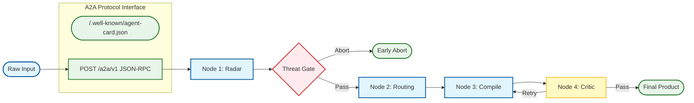

# Prompt Polisher: The Compiler for LLM Prompts

[](https://github.com/RimmonXIA/Prompt_Polisher/actions/workflows/ci.yml)
[](https://www.python.org/downloads/)
[](https://github.com/a2aproject/A2A)
[](LICENSE)

🌐 English | [简体中文](./README.zh.md)

A **multi-node LangGraph compiler** that turns rough intent into structured, safe, and high-performance instructions. Built for prompt engineers and autonomous agents.

---

## 🚀 Why Prompt Polisher?

Most prompts fail because they lack structure, trigger negative constraints, or exhaust the model's single-pass reasoning limit. **Prompt Polisher** treats prompt engineering as a **structured intervention** on attention, compute, and safety:

- 🎯 **Attention Management**: Automatically reinforces instructions at critical positions (Head/Tail) to combat "Lost in the Middle".
- 🛡️ **Built-in Safety**: A multi-layered "Threat Radar" detects and neutralizes prompt injections and alignment risks before they reach your downstream model.
- ⚙️ **Compute-Optimized**: Injects `<thinking>` blocks and ICL (In-Context Learning) few-shots to trade sequence length for reasoning quality.
- 🤖 **Agent-First & A2A Native**: Designed as a tool protocol (JSON envelope, stable exit codes) and a spec-compliant **A2A Participant**. Supports discovery via Agent Cards and real-time task delegation through JSON-RPC and SSE streaming.

---

## 🗺️ Workflow Architecture



---

## ⚡ Quickstart

### 1. Setup
```bash
# Sync dependencies
uv sync --all-groups

# Configure environment
cp .env.example .env   # Edit API keys (OpenAI or DeepSeek)
```

### 2. Usage
```bash
# Basic: Get the compiled prompt
uv run prompt-polisher "Summarize this repo for a release note"

# Professional: Get a Markdown report with full audit trail
uv run prompt-polisher -m "Your requirement"

# Agent-Ready: Output as a versioned JSON envelope
uv run prompt-polisher --envelope "Your requirement"

# Service Mode: Launch A2A HTTP Server
uv run prompt-polisher --serve --port 8000
```

---

## 🛠️ Developer & Automation Guide

### CLI as Tool Protocol
For scripts and coding agents (Cursor, Windsurf, custom workers), treat the CLI as a protocol:
- **stdout**: Carries the primary payload (Text, Markdown, or JSON).
- **stderr**: Carries logs and diagnostic info (use `--quiet` to minimize noise).

#### Exit Codes (Stable for Automation)

| Code | Meaning |
| --- | --- |
| `0` | Success: Compilation finished without being aborted by the threat gate. |
| `2` | Aborted: Run finished but compilation was stopped by the threat gate. |
| `1` | Error: Misconfiguration, I/O failure, or invalid CLI usage. |

#### Envelope Shape (`--envelope`)

The standard JSON envelope includes:
- `compiled`: `true` if and only if the threat gate did not abort.
- `version`: Currently `1`.
- `report`: The full compilation report (radar, routing, critic, deliverables).
- `abort_reason`: `null` on success, or an object with `code`, `message`, and `detail`.

### Implementation Mapping (Theory → Code)

| Node | Primary Implementation |
| --- | --- |
| **Node 1: Radar** | [`src/prompt_polisher/nodes.py`](src/prompt_polisher/nodes.py) (`node_radar`) |
| **Threat Gate** | [`src/prompt_polisher/gate.py`](src/prompt_polisher/gate.py) |
| **Node 2: Routing** | `nodes.py` (`node_routing`) |
| **Node 3: Compile** | `nodes.py` (`node_compile`) |
| **Node 4: Critic** | `nodes.py` (`node_critic`) |
| **Global State** | [`src/prompt_polisher/state.py`](src/prompt_polisher/state.py) |


> [!TIP]
> Set `PROMPT_POLISHER_AGENT=1` in your environment to default to `--envelope` output for all calls.

### Configuration
Key settings in your `.env`:
- `LLM_PROVIDER`: `openai` (default) or `deepseek`.
- `AUTHOR_TRUST_MODE`: Set to `true` to disable strict safety gates for known authors.
- `MAX_CRITIC_ITERATIONS`: Control the feedback loop depth (default: 3).

---

## 🤝 A2A Integration

Prompt Polisher is a [Full A2A Participant](https://github.com/a2aproject/A2A) (Agent-to-Agent Protocol).

- **Discovery**: `uv run prompt-polisher --agent-card` or `GET /.well-known/agent-card.json`
- **A2A Server**: `uv run prompt-polisher --serve --port 8000`
- **Service API**: JSON-RPC 2.0 endpoints for `SendMessage`, `GetTask`, and `SendStreamingMessage` (SSE).
- **Compliance Status**: Full Phase 2 implementation.

---

## 📖 Deep Dives & Theory

| Language | Artifact | Scope |
| --- | --- | --- |
| **Chinese (Canonical)** | [docs/THEORY.zh.md](docs/THEORY.zh.md) | **Source of Truth**: Full architecture, evidence grades, and theory map. |
| **English (Summary)** | [docs/THEORY.en.md](docs/THEORY.en.md) | **Bridge**: Scope, non-claims, and architectural overview for international teams. |

---

**Contributing:** see [CONTRIBUTING.md](CONTRIBUTING.md).  
**Security:** see [SECURITY.md](SECURITY.md).  
**Code of Conduct:** [CODE_OF_CONDUCT.md](CODE_OF_CONDUCT.md).
