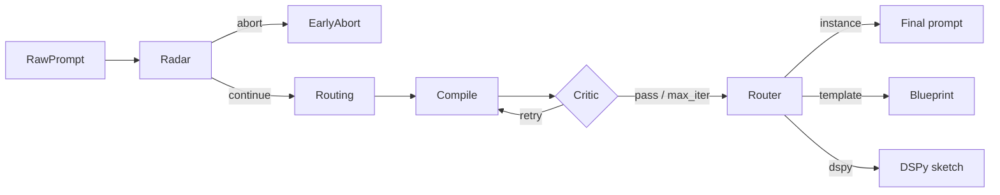

# Prompt Polisher

[](https://github.com/RimmonXIA/Prompt_Polisher/actions/workflows/ci.yml)
[](https://www.python.org/downloads/)
[](LICENSE)

**TL;DR (English).** **Python 3.11+ CLI**: a **LangGraph** multi-node **prompt compiler**—radar → optional **threat gate** → routing → structured compile → **critic** loop—plus blueprint and DSPy-style sketches; use **`--envelope`** / **`--report-json`** for agents and automation; **OpenAI**- or **DeepSeek**-compatible backends via `LLM_PROVIDER`.

**一句话（中文）。** **Python 命令行工具**（3.11+）：基于 **LangGraph** 的多节点**提示词编译**流水线（意图雷达 → 可选威胁闸门 → 路由 → 编译 → **Critic**），支持 **`--envelope` / `--report-json`** 供 Agent 与自动化消费；理论长文见下文链接。

**English.** Prompt Polisher is a **multi-node LangGraph workflow** that turns rough user intents into compiled prompts: radar → routing and anchoring → structured compile → critic loop, with optional multi-step blueprint and DSPy-style sketches. It helps produce **heuristically** stronger, safer prompt text; **downstream task success and safety still depend on the model you run and your system design**, not on this CLI alone. **Full theory is in Chinese:** [docs/THEORY.zh.md](docs/THEORY.zh.md) (canonical: diagram, theory map, evidence grades, limits, references). **English bridge** (~10–15 min): scope, non-claims, when *not* to use, related work — [docs/THEORY.en.md](docs/THEORY.en.md).

**中文.** Prompt Polisher 是基于 **LangGraph** 的多节点 Agentic 工作流：将原始需求经「意图雷达 → 算力/流形路由 → 结构化编译 → 红队 Critic 闭环」重组为更可执行的提示词与蓝图。完整架构图与长篇理论（含**导读**、**理论地图**与分层推导）见 [docs/THEORY.zh.md](docs/THEORY.zh.md)；英文短导读见 [docs/THEORY.en.md](docs/THEORY.en.md)。

## Quickstart

| | |
| --- | --- |
| **EN** | Copy [`.env.example`](.env.example) to `.env`, set `OPENAI_API_KEY` or `DEEPSEEK_API_KEY` (and `LLM_PROVIDER` if needed). Run `uv sync --all-groups`, then `uv run prompt-polisher --dry-run` to verify settings, and `uv run prompt-polisher "Your raw task"` to print the compiled prompt. Use `--markdown` for a readable compilation report, `--report-json` for a structured JSON report, `--envelope` (or `--agent`) for a versioned agent/tool JSON envelope, or `--json` for the full graph state. |
| **中文** | 将 [`.env.example`](.env.example) 复制为 `.env`，填写 `OPENAI_API_KEY` 或 `DEEPSEEK_API_KEY` 等。执行 `uv sync --all-groups`，`uv run prompt-polisher --dry-run` 校验配置，`uv run prompt-polisher "你的原始需求"` 输出最终 prompt；`--markdown` 输出可读编译报告，`--report-json` 输出结构化报告 JSON，`--envelope` / `--agent` 输出带版本字段的 JSON 信封，`--json` 输出完整图状态。 |

```bash
uv sync --all-groups
cp .env.example .env   # edit API keys and LLM_PROVIDER
uv run prompt-polisher --dry-run
uv run prompt-polisher "Summarize this repository for a release note."
uv run prompt-polisher --json "Your raw requirement"
```

**Examples.** Redacted / synthetic inputs and report shapes (`--markdown` / `--report-json`) live under [examples/](examples/).

## Theory and architecture

**English.** The project treats prompt engineering as **structured intervention** on attention, compute (tokens and chain-of-thought), logits, and safety boundaries—not as a one-shot paraphrase. The main chain is radar → (optional gate) → routing → compile (system prompt includes **§2.5-style ICL/few-shot guidance embedded in the `draft` text**) → critic. Optionally set `CRITIC_USE_PRM=true` to run a **scalar process score** on the compiled draft before the text Critic (extra LLM call). The CLI outputs **text prompts only**; decoding knobs such as temperature, top-p, or logit masks are configured at **your downstream API**. **[docs/THEORY.zh.md](docs/THEORY.zh.md) is the sole canonical theory document** (diagram notes, implementation-scope table, theory map, evidence labels, limits, primary references); it does **not** promise global optimality or universal safety for every model. For an English summary of scope and positioning, see **[docs/THEORY.en.md](docs/THEORY.en.md)**.

**中文.** 项目将提示词工程视为对注意力、算力、Logits 与安全边界的**结构化干预**（控制论式“最优”表述仅为类比），而非单次润色。主链为雷达 →（可选闸门）→ 路由 → 编译（含 **§2.5 式 ICL/few-shot 写入 `draft` 的提示指引**）→ 红队 Critic。**[docs/THEORY.zh.md](docs/THEORY.zh.md) 为本仓库理论表述的唯一权威来源**（架构图注、实现范围表、理论地图、证据等级、局限性与非承诺、英文 Primary 参考文献）；**不**承诺对任意模型的全局最优或普适安全保证。英文短导读见 [docs/THEORY.en.md](docs/THEORY.en.md)。



---

## 开发者指南

### 前置条件

- Python 3.11+
- [uv](https://docs.astral.sh/uv/)（用于依赖与虚拟环境）

### 安装

```bash
uv sync --all-groups
```

可选：启用 Langfuse SDK 追踪时安装可选依赖：

```bash
uv sync --extra langfuse
```

### 配置

将 [`.env.example`](.env.example) 复制为 `.env`，按需填写 `OPENAI_API_KEY` / `DEEPSEEK_API_KEY`、`LLM_PROVIDER`、`MAX_CRITIC_ITERATIONS`、`AUTHOR_TRUST_MODE`、威胁闸门相关变量（`ABORT_ON_HEURISTIC_INJECTION`、`ABORT_ON_RADAR_HIGH`）等。可选：`CRITIC_USE_PRM=true` 时在进入文本 Critic 之前对 `draft` 做一次 **过程式标量打分**（额外一次 LLM 调用，默认关闭）；`PRM_MODEL`、`PRM_MIN_SCORE`、`PRM_TEMPERATURE` 见 `.env.example`。本 CLI **只产出文本型 prompt**；**temperature / top-p / logits 掩码** 等解码参数由你在调用最终模型时的 API 侧配置。Radar 之后若闸门触发，将 **不再** 执行路由/编译/Critic/Router，仅返回简短说明（`compilation_aborted`）。不要在仓库中提交真实密钥。

### 命令行

```bash
# 查看解析后的模型与上限（不调用 LLM）
uv run prompt-polisher --dry-run

# 从参数传入原始需求，打印最终 prompt
uv run prompt-polisher "你的原始需求"

# 打印完整状态 JSON（含 blueprint / dspy_sketch 等）
uv run prompt-polisher --json "你的原始需求"

# 人类可读的 Markdown 编译报告（含雷达/路由/Critic/交付物）
uv run prompt-polisher --markdown "你的原始需求"

# 同上，并包含「原始输入 vs 最终 prompt」对照（交付物中不再重复 Final 区块）
uv run prompt-polisher --markdown --report-before-after "你的原始需求"

# 结构化编译报告 JSON（状态的子集，便于流水线消费）
uv run prompt-polisher --report-json "你的原始需求"

# 省略报告顶部的 Executive summary
uv run prompt-polisher --markdown --no-report-summary "你的原始需求"

# 版本化 JSON 信封（供 Agent / 工具协议使用；与 --report-json 互斥）
uv run prompt-polisher --envelope "你的原始需求"
# 等价别名
uv run prompt-polisher --agent "你的原始需求"

# 包版本（不调用 LLM）
uv run prompt-polisher --version

# 仅警告与错误日志（stderr），减轻自动化场景下的 stderr 噪声
uv run prompt-polisher --quiet --envelope "你的原始需求"
```

### Agents and automation (CLI as tool protocol)

For scripts, CI, and coding agents, treat the CLI as a small **tool protocol**: **stdout** carries the primary payload; **logging** goes to **stderr** (see [`src/prompt_polisher/logging_config.py`](src/prompt_polisher/logging_config.py)). Prefer **`--envelope`** or **`--report-json`** when you need structured radar / gate / critic context, not only the final prompt string.

**Exit codes** (stable for automation):

| Code | Meaning |
| --- | --- |
| `0` | Run finished and the threat gate did **not** abort compilation (`compilation_aborted` is false). Applies to every output mode (default text, `--markdown`, `--json`, `--report-json`, `--envelope`). |
| `2` | Run finished but compilation was **aborted** after radar (threat gate). Inspect JSON fields (`summary.compilation_aborted`, envelope `ok` / `error`) or the Markdown report for details. |
| `1` | Misconfiguration, I/O failure, unexpected error, or invalid CLI usage. |

**Environment**

- `PROMPT_POLISHER_AGENT`: if set to a truthy value (`1`, `true`, `yes`, `on`) and you do **not** pass `--json`, `--markdown`, `--report-json`, or `--envelope`, the CLI prints **`--envelope`** JSON on stdout (same exit semantics as above).
- `LOG_LEVEL` / `LOG_JSON`: see [`.env.example`](.env.example); reduce noise with `--quiet` (stderr shows warnings and errors only).
- **Structured JSON to stdout** (`--json`, `--report-json`, `--envelope` / `--agent`, or `PROMPT_POLISHER_AGENT` defaulting to envelope): `httpx` and `httpcore` INFO lines on stderr are raised to WARNING so request spam does not drown out your payload; use **`--verbose`** to restore those HTTP logs; use **`--quiet`** to also drop most `prompt_polisher` INFO on stderr.

**Envelope shape** (`--envelope` / `--agent`): top-level keys `ok`, `schemaVersion` (currently `1`), `data` (same content shape as `--report-json`), and `error` (`null` on success, or an object with `code`, `message`, `detail` when the gate aborts). Bump `schemaVersion` only when intentionally breaking the envelope layout.

**Meaning of `ok`:** `true` **if and only if** the run did **not** stop at the threat gate (`compilation_aborted` is false). It is **not** HTTP status, not “downstream task succeeded,” and not a quality score—use `data` and your own checks for those.

**LLM-shaped JSON:** In `--report-json` and envelope `data`, `radar_analysis` and `routing_decision` are **model-produced objects**; **key sets are not stable** across models or prompts. For automation, rely on `summary`, `deliverables`, and (when present) envelope `error`; treat other keys inside those objects as **optional extensions**.

**Threat gate `abort_reason` values** (machine strings; also appear in envelope `error.message` when aborted). Authoritative list: [docs/AUDIT_SELF_EXPLAINING.md](docs/AUDIT_SELF_EXPLAINING.md) §3.5.

| `abort_reason` | Trigger (summary) |
| --- | --- |
| `heuristic_prompt_injection` | Raw prompt matched local injection heuristics (`ABORT_ON_HEURISTIC_INJECTION`). |
| `radar_possible_prompt_injection` | Radar `threats` contained `possible_prompt_injection`. |
| `radar_alignment_risk_high` | Radar `alignment_risk` is `high` and `ABORT_ON_RADAR_HIGH` is true. |
| `radar_high_with_threats_untrusted` | Untrusted author mode, `alignment_risk` high, and non-empty threats. |
| `graph_miswired_early_abort_without_trigger` | Should not occur in normal runs (graph wiring error). |

**中文简述：** 自动化时请用 **stdout 解析结果、stderr 看日志**；需要结构化上下文时用 **`--envelope` / `--report-json`**；用 **退出码 0 / 2 / 1** 区分成功编译、闸门中止与错误；信封字段 **`ok`** 仅表示**未因威胁闸门中止**，不等于任务或模型输出成功；**`radar_analysis` / `routing_decision` 内键名不保证稳定**。设置 **`PROMPT_POLISHER_AGENT=1`** 可在未指定其它输出格式时默认输出信封 JSON；JSON 主输出模式下默认压低 **`httpx`/`httpcore`** 的 INFO，需要排障时用 **`--verbose`**，需要更少本仓库日志时用 **`--quiet`**。

Langfuse 连通性与凭证探测：

```bash
uv run prompt-polisher-langfuse-check
```

**`prompt-polisher-langfuse-check` exit codes:**

| Code | Meaning |
| --- | --- |
| `0` | Langfuse **health** endpoint returned HTTP 200. If `LANGFUSE_PUBLIC_KEY` or `LANGFUSE_SECRET_KEY` is missing, the tool **skips** credential verification and still exits `0` (not a failure—configure keys when you want auth checked). |
| `1` | Health check non-200, or credentials were set but project API auth failed, or response was not valid JSON. |

### 测试与静态检查

```bash
uv run pytest
uv run ruff check src tests
uv run mypy src
```

可选（需网络）：检查 [docs/THEORY.zh.md](docs/THEORY.zh.md) 中参考文献 URL（先 HEAD，必要时 GET）：

```bash
uv run python scripts/check_theory_urls.py
# 仅列出 URL、不访问网络：
uv run python scripts/check_theory_urls.py --list-only
```

### 实现映射（理论节点 → 代码）

| 架构节点 | 主要实现 |
| --- | --- |
| Node 1：意图解构与对齐雷达 | [`src/prompt_polisher/nodes.py`](src/prompt_polisher/nodes.py) 中 `node_radar`；注入启发式见 [`src/prompt_polisher/text.py`](src/prompt_polisher/text.py) |
| ThreatGate：雷达后可选提前终止 | [`src/prompt_polisher/gate.py`](src/prompt_polisher/gate.py)（`should_abort_after_radar`、`node_early_abort`）；编排见 [`src/prompt_polisher/graph.py`](src/prompt_polisher/graph.py) |
| Node 2：算力调度与流形寻址 | `node_routing` |
| Node 3：结构化编译 | `node_compile` |
| Node 4：闭环红队审查 | `node_critic`（规则前置；可选 `CRITIC_USE_PRM` 过程打分后再走文本 Critic） |
| 输出路由与三态产物 | `node_router`；编排与 Critic 回路见 [`src/prompt_polisher/graph.py`](src/prompt_polisher/graph.py) |
| 全局状态 | [`src/prompt_polisher/state.py`](src/prompt_polisher/state.py) 中 `GraphState` |
| 配置与 LLM | [`src/prompt_polisher/config.py`](src/prompt_polisher/config.py)、[`src/prompt_polisher/llm.py`](src/prompt_polisher/llm.py) |
| 可选过程打分（PRM 式） | [`src/prompt_polisher/prm.py`](src/prompt_polisher/prm.py) |
| 命令行入口 | [`src/prompt_polisher/cli.py`](src/prompt_polisher/cli.py) |
| 日志 | [`src/prompt_polisher/logging_config.py`](src/prompt_polisher/logging_config.py) |
| 可选 Langfuse | [`src/prompt_polisher/observability.py`](src/prompt_polisher/observability.py)（`LANGFUSE_TRACING=true` 且安装 `langfuse` 时） |

**LangSmith**：按 `.env.example` 设置 `LANGCHAIN_TRACING_V2`、`LANGCHAIN_API_KEY`、`LANGCHAIN_PROJECT` 等；CLI 在启动时会调用 `Settings.apply_langchain_env()`，由 LangChain/LangGraph 在运行时读取这些环境变量（无需在本仓库内再写一层封装）。

CI 使用 GitHub Actions（`uv sync --frozen`、ruff、mypy、pytest；**Python 3.11 与 3.12 矩阵**；pytest 覆盖率不低于 70%），见 [`.github/workflows/ci.yml`](.github/workflows/ci.yml)。

**Contributing:** see [CONTRIBUTING.md](CONTRIBUTING.md). **Security:** see [SECURITY.md](SECURITY.md). **Code of conduct:** [CODE_OF_CONDUCT.md](CODE_OF_CONDUCT.md).
