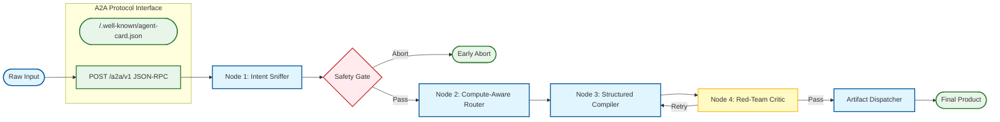

# Prompt Polisher: The Compiler for LLM Prompts

[](https://github.com/RimmonXIA/Prompt_Polisher/actions/workflows/ci.yml)
[](https://www.python.org/downloads/)
[](https://github.com/a2aproject/A2A)
[](LICENSE)

🌐 English | [简体中文](./README.zh.md)

*Just as GCC compiles C into deterministic machine code, Prompt Polisher compiles human ambiguity into deterministic LLM context.*

A **multi-node LangGraph compiler** that turns rough intent into structured, safe, and high-performance instructions. Built for prompt engineers and autonomous agents.

---

## 💡 The "Aha" Moment

Stop wrestling with models that ignore your constraints or hallucinate formats.

**Before (Rough Intent):**
> "Summarize this repo for a release note and make sure it's good."

**After (Compiled by Prompt Polisher):**
```xml
<task_context>
The user requires a release note summary for the current repository...
</task_context>
<primary_directive>
Generate a structured release note summary based on the provided repository context.
</primary_directive>
<constraints>
- Maintain a professional and concise tone.
- Do not invent or hallucinate features not present in the context.
- Format the output using markdown headers and bullet points.
</constraints>
```
*(The compiler automatically infers constraints, injects structural anchors, and frames instructions positively for maximum compliance.)*

---

## 🚀 Why Prompt Polisher?

Most prompts fail because they lack structure, trigger negative constraints, or exhaust the model's reasoning limit. Prompt Polisher intervenes across three core pillars:

### ⚡️ High-Performance (Cognitive Optimization)
- **Attention Management**: Combats the "Lost in the Middle" effect by reinforcing instructions at **Head/Tail** positions and applying **Anchor Personas** to stabilize style and detail.
- **Compute-Optimized**: Injects `<task_context>` blocks and ICL (In-Context Learning) few-shots to trade sequence length for reasoning quality. 
- **Style Enhancement**: Actively detects low-entropy inputs and intervenes via vocabulary elevation and structural priming to ensure the target model mirrors expert-level cognitive standards.

### 🛡️ Built-in Safety & Compliance
- **Threat Radar**: A heuristic pre-scan augments a model-based Intent Sniffer to detect prompt injections and alignment violations before execution.
- **Sandboxed Execution**: Uses **XML Sandboxing** for strict instruction isolation.
- **Quality Control**: Supports optional automated output scoring (process-level quality gating) to reject sub-par completions before they reach your users.

### 🔌 Developer & Agent Native
- **Multi-Track Artifacts**: Emits finalized prompts, **LangGraph blueprints**, and **DSPy sketches** for downstream automation. 
- **A2A Protocol Ready**: Designed as a spec-compliant **A2A Participant** with full JSON-RPC and SSE support.
- **Provider-Agnostic**: Internal routing uses **LiteLLM**, providing a single configuration surface for OpenAI, Anthropic, Gemini, DeepSeek, and more.

---

## ⚡ Quickstart

### 1. Setup
```bash
# Sync dependencies
uv sync --all-groups

# Configure environment
cp .env.example .env   # Edit API keys (OpenAI, DeepSeek, Claude, Gemini, etc.)
```

### 2. Usage
```bash
# Basic: Get the compiled prompt
uv run prompt-polisher "Summarize this repo for a release note"

# Fine-grained: Use the pro model for complex reasoning
uv run prompt-polisher --pro "Your complex requirement"

# Professional: Get a Markdown report with full audit trail
uv run prompt-polisher -m "Your requirement"

# Agent-Ready: Output as a versioned JSON envelope
uv run prompt-polisher --envelope "Your requirement"

# Service Mode: Launch A2A HTTP Server
uv run prompt-polisher --serve --port 8000
```

### 3. Example reports & library use
- **Sample outputs**: [examples/](examples/README.md) covers a normal run, a **threat-gate abort**, and a **multi-node routing** hint.
- **Embed in Python**: Call [`run_compiler_async`](src/prompt_polisher/graph.py) with your `Settings` and [`LLMClient`](src/prompt_polisher/llm.py). Code-accurate sequence and state flow: **[docs/CLI_INVOCATION_FLOW.md](docs/CLI_INVOCATION_FLOW.md)**.

---

## 🗺️ How it Works (Workflow Architecture)

Behind the scenes, Prompt Polisher orchestrates a multi-agent LangGraph workflow. It acts as an **architectural analyst**, strictly separating the compilation process from the final downstream execution to prevent "role-playing" confusion.



---

## 🛠️ Developer & Automation Guide

### CLI as Tool Protocol
For scripts and coding agents (Cursor, Windsurf, custom workers), treat the CLI as a protocol:
- **stdout**: Carries the primary payload (Text, Markdown, or JSON).
- **stderr**: Carries logs and diagnostic info (use `--quiet` to minimize noise).
- **Interactive TTY**: stderr prints a Rich splash panel with a terminal-width-aware preview of your input.

#### Exit Codes (Stable for Automation)
| Code | Meaning |
| --- | --- |
| `0` | Success: Compilation finished without being aborted by the safety gate. |
| `2` | Aborted: Run finished but compilation was stopped by the safety gate. |
| `1` | Error: Misconfiguration, I/O failure, or invalid CLI usage. |

#### Envelope Shape (`--envelope`)
The standard JSON envelope includes:
- `compiled`: `true` if and only if the safety gate did not abort.
- `version`: Currently `1`.
- `report`: The full compilation report.
- `abort_reason`: `null` on success, or an object with `code`, `message`, and `detail`.

### Evaluation harness
Versioned tasks under `evalsets/bundled/` with Tier A structural checks and optional Tier B executor scoring.
```bash
uv run prompt-polisher-eval --help
uv run prompt-polisher-eval --structural-only --fail-on-structural
uv run prompt-polisher-eval --output eval-report.json
```
Override directory with `PROMPT_POLISHER_EVALSET` or `--evalset-dir`. Details: [`evalsets/bundled/README.md`](evalsets/bundled/README.md).

> [!TIP]
> Set `PROMPT_POLISHER_AGENT=1` in your environment to default to `--envelope` output for all calls.

### Configuration
Key settings in your `.env`:
- `LLM_PROVIDER`: `deepseek` (default), `openai`, `anthropic`, `google`, `zhipu`, `aliyun`, etc.
- `LLM_MODEL`: Target model (e.g., `deepseek-v4-flash`, `deepseek-v4-pro`, `gpt-4o-mini`).
- `LLM_API_KEY`: Universal API key. Still supports `OPENAI_API_KEY`, etc.
- `AUTHOR_TRUST_MODE`: Set to `true` to disable strict safety gates for known authors.
- `CRITIC_USE_PRM`: Enable optional scalar-based process reward gating (heuristic).
- **Langfuse**: Set `LANGFUSE_TRACING=true` plus keys to enable tracing.

> [!IMPORTANT]
> Prompt Polisher emits **text artifacts only**. It does not perform constrained decoding (logits masking) or sampling within the tool; configure those in your downstream decoder/API client.

---

## 🤝 A2A Integration

Prompt Polisher is a [Full A2A Participant](https://github.com/a2aproject/A2A) (Agent-to-Agent Protocol).

- **Discovery**: `uv run prompt-polisher --agent-card` or `GET /.well-known/agent-card.json`
- **A2A Server**: `uv run prompt-polisher --serve --port 8000`
- **Service API**: JSON-RPC 2.0 endpoints for `SendMessage`, `GetTask`, `ListTasks`, and `SendStreamingMessage` (SSE).

---

## 📖 Deep Dives & Theory

For architecture details, roles taxonomy (Invoker, Orchestrator, Executor), and theoretical frameworks, refer to the documentation:

| Language | Artifact | Scope |
| --- | --- | --- |
| **English** | [docs/ARCHITECTURE.en.md](docs/ARCHITECTURE.en.md) | **Architecture Bridge**: Core philosophy, strict boundaries, and compilation pipeline. |
| **English** | [docs/CLI_INVOCATION_FLOW.md](docs/CLI_INVOCATION_FLOW.md) | **Implementation Map**: Mermaid views of CLI → graph → API. |
| **Chinese (Only)** | [docs/THEORY.zh.md](docs/THEORY.zh.md) | **Deep Dive**: Full academic theory, evidence grades, and mechanistic details. |

---

**Contributing:** see [CONTRIBUTING.md](CONTRIBUTING.md).  
**Security:** see [SECURITY.md](SECURITY.md).  
**Code of Conduct:** [CODE_OF_CONDUCT.md](CODE_OF_CONDUCT.md).
