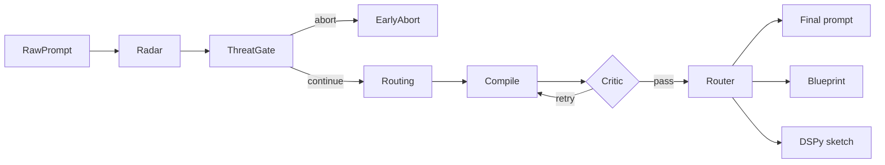

# Prompt Polisher

[](https://github.com/RimmonXIA/Prompt_Polisher/actions/workflows/ci.yml)
[](https://www.python.org/downloads/)
[](LICENSE)

**English.** Prompt Polisher is a **multi-node LangGraph workflow** that turns rough user intents into compiled prompts: radar → routing and anchoring → structured compile → critic loop, with optional multi-step blueprint and DSPy-style sketches. It is for builders who want stronger, safer prompts without hand-tuning every token. For the full architecture diagram and long-form Chinese theory, see [docs/THEORY.zh.md](docs/THEORY.zh.md).

**中文.** Prompt Polisher 是基于 **LangGraph** 的多节点 Agentic 工作流：将原始需求经「意图雷达 → 算力/流形路由 → 结构化编译 → 红队 Critic 闭环」重组为更可执行的提示词与蓝图。完整架构图与长篇理论见 [docs/THEORY.zh.md](docs/THEORY.zh.md)。

## Quickstart

| | |
| --- | --- |
| **EN** | Copy [`.env.example`](.env.example) to `.env`, set `OPENAI_API_KEY` or `DEEPSEEK_API_KEY` (and `LLM_PROVIDER` if needed). Run `uv sync --all-groups`, then `uv run prompt-polisher --dry-run` to verify settings, and `uv run prompt-polisher "Your raw task"` to print the compiled prompt. Use `--markdown` for a readable compilation report, `--report-json` for a structured JSON report, or `--json` for the full graph state. |
| **中文** | 将 [`.env.example`](.env.example) 复制为 `.env`，填写 `OPENAI_API_KEY` 或 `DEEPSEEK_API_KEY` 等。执行 `uv sync --all-groups`，`uv run prompt-polisher --dry-run` 校验配置，`uv run prompt-polisher "你的原始需求"` 输出最终 prompt；`--markdown` 输出可读编译报告，`--report-json` 输出结构化报告 JSON，`--json` 输出完整图状态。 |

```bash
uv sync --all-groups
cp .env.example .env   # edit API keys and LLM_PROVIDER
uv run prompt-polisher --dry-run
uv run prompt-polisher "Summarize this repository for a release note."
uv run prompt-polisher --json "Your raw requirement"
```

## Theory and architecture

**English.** The project treats prompt engineering as **structured intervention** on attention, compute (tokens and chain-of-thought), logits, and safety boundaries—not as a one-shot paraphrase. The four stages (radar, routing, compile, critic) implement that view end to end. The extended narrative (thirteen mechanism layers, formulas, and security discussion) lives in [docs/THEORY.zh.md](docs/THEORY.zh.md).

**中文.** 项目将提示词工程视为对注意力、算力、Logits 与安全边界的**结构化数学干预**，而非单次润色。四步引擎在工程上对应雷达、路由、编译与红队审查；分层推导与公式详见 [docs/THEORY.zh.md](docs/THEORY.zh.md)。



---

## 开发者指南

### 前置条件

- Python 3.11+
- [uv](https://docs.astral.sh/uv/)（用于依赖与虚拟环境）

### 安装

```bash
uv sync --all-groups
```

可选：启用 Langfuse SDK 追踪时安装可选依赖：

```bash
uv sync --extra langfuse
```

### 配置

将 [`.env.example`](.env.example) 复制为 `.env`，按需填写 `OPENAI_API_KEY` / `DEEPSEEK_API_KEY`、`LLM_PROVIDER`、`MAX_CRITIC_ITERATIONS`、`AUTHOR_TRUST_MODE`、威胁闸门相关变量（`ABORT_ON_HEURISTIC_INJECTION`、`ABORT_ON_RADAR_HIGH`）等。Radar 之后若闸门触发，将 **不再** 执行路由/编译/Critic/Router，仅返回简短说明（`compilation_aborted`）。不要在仓库中提交真实密钥。

### 命令行

```bash
# 查看解析后的模型与上限（不调用 LLM）
uv run prompt-polisher --dry-run

# 从参数传入原始需求，打印最终 prompt
uv run prompt-polisher "你的原始需求"

# 打印完整状态 JSON（含 blueprint / dspy_sketch 等）
uv run prompt-polisher --json "你的原始需求"

# 人类可读的 Markdown 编译报告（含雷达/路由/Critic/交付物）
uv run prompt-polisher --markdown "你的原始需求"

# 同上，并包含「原始输入 vs 最终 prompt」对照（交付物中不再重复 Final 区块）
uv run prompt-polisher --markdown --report-before-after "你的原始需求"

# 结构化编译报告 JSON（状态的子集，便于流水线消费）
uv run prompt-polisher --report-json "你的原始需求"

# 省略报告顶部的 Executive summary
uv run prompt-polisher --markdown --no-report-summary "你的原始需求"
```

Langfuse 连通性与凭证探测（需配置 `LANGFUSE_*` 时才有意义）：

```bash
uv run prompt-polisher-langfuse-check
```

### 测试与静态检查

```bash
uv run pytest
uv run ruff check src tests
uv run mypy src
```

### 实现映射（理论节点 → 代码）

| 架构节点 | 主要实现 |
| --- | --- |
| Node 1：意图解构与对齐雷达 | [`src/prompt_polisher/nodes.py`](src/prompt_polisher/nodes.py) 中 `node_radar`；注入启发式见 [`src/prompt_polisher/text.py`](src/prompt_polisher/text.py) |
| Node 2：算力调度与流形寻址 | `node_routing` |
| Node 3：结构化编译 | `node_compile` |
| Node 4：闭环红队审查 | `node_critic`（含规则前置检查） |
| 输出路由与三态产物 | `node_router`；编排与 Critic 回路见 [`src/prompt_polisher/graph.py`](src/prompt_polisher/graph.py) |
| 全局状态 | [`src/prompt_polisher/state.py`](src/prompt_polisher/state.py) 中 `GraphState` |
| 配置与 LLM | [`src/prompt_polisher/config.py`](src/prompt_polisher/config.py)、[`src/prompt_polisher/llm.py`](src/prompt_polisher/llm.py) |
| 日志 | [`src/prompt_polisher/logging_config.py`](src/prompt_polisher/logging_config.py) |
| 可选 Langfuse | [`src/prompt_polisher/observability.py`](src/prompt_polisher/observability.py)（`LANGFUSE_TRACING=true` 且安装 `langfuse` 时） |

**LangSmith**：按 `.env.example` 设置 `LANGCHAIN_TRACING_V2`、`LANGCHAIN_API_KEY`、`LANGCHAIN_PROJECT` 等；CLI 在启动时会调用 `Settings.apply_langchain_env()`，由 LangChain/LangGraph 在运行时读取这些环境变量（无需在本仓库内再写一层封装）。

CI 使用 GitHub Actions（`uv sync --frozen`、ruff、mypy、pytest），见 [`.github/workflows/ci.yml`](.github/workflows/ci.yml)。

**Contributing:** see [CONTRIBUTING.md](CONTRIBUTING.md). **Security:** see [SECURITY.md](SECURITY.md). **Code of conduct:** [CODE_OF_CONDUCT.md](CODE_OF_CONDUCT.md).
