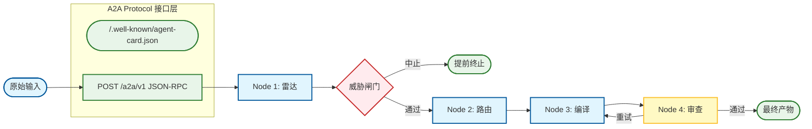

# Prompt Polisher: 大模型提示词编译器

[](https://github.com/RimmonXIA/Prompt_Polisher/actions/workflows/ci.yml)
[](https://www.python.org/downloads/)
[](https://github.com/a2aproject/A2A)
[](LICENSE)

🌐 [English](./README.md) | 简体中文

基于 **LangGraph** 的多节点**提示词编译**流水线：将原始需求重塑为具备更强注意力分配管理和安全边界的高质量 Prompt。专为提示词工程师与自主 Agent 设计。

---

## 🚀 为什么选择 Prompt Polisher？

大多数 Prompt 失败的原因在于：缺乏结构、误触负向约束，或者透支了模型单次思考的逻辑极限。**Prompt Polisher** 将提示词工程视为对大模型注意力、算力和安全边界的**结构化干预**：

- 🎯 **注意力管理 (Attention Management)**：通过**首尾强化**对抗 "Lost in the Middle" 效应，并引入**锚点角色 (Anchor Persona)** / 流形寻址以稳定输出风格与详略。
- 🛡️ **内置安全闸门 (Built-in Safety)**：多层“威胁雷达”探测注入攻击与对齐风险。使用 **XML 沙盒隔离 (XML Sandboxing)** 确保指令隔离，并支持可选的 **PRM 式标量门控** 进行过程质量控制。
- ⚙️ **算力优化 (Compute-Optimized)**：自动注入 `<thinking>` 标签与 ICL 少样本示范。利用**雷达驱动的正向化改写 (Positive Framing)** 中和意图解构中的指令失效。
- 🎨 **风格镜像干预 (Style Mirroring Intervention)**：检测低熵输入 (Perspective Mimesis) 并通过**词量提升 (Vocabulary Elevation)** 与**结构启动 (Structural Priming)** 进行主动干预，确保目标模型镜像出专家级的认知标准。
- 🤖 **多轨输出与 A2A 原生**：除 Prompt 外，同时产出 **LangGraph 蓝图** 与 **DSPy 代码草图**。作为全合规 **A2A 参与者**，支持 JSON-RPC 与 SSE 实时任务委托。

---

## 🗺️ 工作流架构 (Workflow Architecture)



---

## ⚡ 快速开始

### 1. 安装配置 (Setup)
```bash
# 同步依赖
uv sync --all-groups

# 配置环境变量
cp .env.example .env   # 填写 API Keys (OpenAI, DeepSeek, Claude, Gemini 等)
```

### 2. 使用方法 (Usage)
```bash
# 基础模式: 直接获取编译后的 prompt
uv run prompt-polisher "Summarize this repo for a release note"

# 专业模式: 获取包含完整审计轨迹的 Markdown 报告
uv run prompt-polisher -m "你的原始需求"

# Agent 模式: 输出版本化的 JSON 信封，供自动化脚本解析
uv run prompt-polisher --envelope "你的原始需求"

# 服务模式: 启动 A2A HTTP 服务器
uv run prompt-polisher --serve --port 8000
```

---

## 🛠️ 开发者与自动化指南

### 将 CLI 作为工具协议
对于脚本和编码 Agent (如 Cursor, Windsurf, 或自定义 worker) 而言，应将 CLI 视为一个协议来使用：
- **stdout**: 承载主要返回体（文本、Markdown 或 JSON）。
- **stderr**: 承载日志与诊断信息（使用 `--quiet` 参数可减少无用噪音）。

#### 自动化退出码 (Exit Codes)

| 状态码 | 含义 |
| --- | --- |
| `0` | **成功**: 编译成功结束，且未被威胁闸门中止。 |
| `2` | **中止**: 执行结束，但由于检测到威胁，编译被闸门中止。 |
| `1` | **错误**: 配置有误、I/O 失败或无效的 CLI 调用。 |

#### 数据信封结构 (`--envelope`)

标准的 JSON 信封包含以下字段：
- `compiled`: 当且仅当未被威胁闸门中止时为 `true`。
- `version`: 当前版本为 `1`。
- `report`: 包含雷达、路由、审查和交付物等完整编译报告。
- `abort_reason`: 成功时为 `null`；当被闸门中止时为一个包含 `code`, `message`, 与 `detail` 的对象。

### 理论与代码实现映射 (Implementation Mapping)

| 架构节点 | 核心代码实现 |
| --- | --- |
| **Node 1: 雷达 (Radar)** | [`src/prompt_polisher/nodes.py`](src/prompt_polisher/nodes.py) (`node_radar`) |
| **威胁闸门 (Threat Gate)** | [`src/prompt_polisher/gate.py`](src/prompt_polisher/gate.py) |
| **Node 2: 路由 (Routing)** | `nodes.py` (`node_routing`) |
| **Node 3: 编译 (Compile)** | `nodes.py` (`node_compile`) |
| **Node 4: 审查 (Critic)** | `nodes.py` (`node_critic`) |
| **全局状态 (Global State)** | [`src/prompt_polisher/state.py`](src/prompt_polisher/state.py) |
| **评测基线** | [`src/prompt_polisher/eval/`](src/prompt_polisher/eval/), [`evalsets/bundled/`](evalsets/bundled/README.md) |

### CLI 调用链（Mermaid 参考）

与 `uv run prompt-polisher` 一致的端到端示意图：CLI 启动、LangGraph 边、[`prompts/`](src/prompt_polisher/prompts/) 与 [`prompts_bundle.py`](src/prompt_polisher/prompts_bundle.py)、标准输出/标准错误模式、`GraphState` 更新 — 见 **[docs/CLI_INVOCATION_FLOW.md](docs/CLI_INVOCATION_FLOW.md)**（英文正文）。

### 评测基线

`evalsets/bundled/` 提供版本化任务：**Tier A** 仅跑编译图并检查结构化期望；**Tier B**（可选）对 `items.jsonl` 中配置了 `gold` 的条目做 **原始意图 vs 编译稿** 的成对执行器打分。

```bash
uv run prompt-polisher-eval --help
uv run prompt-polisher-eval -V
uv run prompt-polisher-eval --structural-only --fail-on-structural
uv run prompt-polisher-eval --output eval-report.json
```

可用 `PROMPT_POLISHER_EVALSET` 或 `--evalset-dir` 指定目录。说明见 [`evalsets/bundled/README.md`](evalsets/bundled/README.md)；可选工作流：[`eval-live.yml`](.github/workflows/eval-live.yml)。


> [!TIP]
> 在环境变量中设置 `PROMPT_POLISHER_AGENT=1`，可以使所有调用默认输出 `--envelope` 格式的数据包。

### 核心配置 (Configuration)
位于 `.env` 中的关键设置：
- `LLM_PROVIDER`: `openai`（默认）、`deepseek`、`anthropic`、`google`、`zhipu`、`aliyun` 等。
- `LLM_MODEL`: 目标模型名称（如 `gpt-4o-mini`、`claude-3-5-sonnet-20240620`、`gemini/gemini-1.5-pro`）。
- `LLM_API_KEY`: 通用 API 秘钥。为保证兼容性，仍支持 `OPENAI_API_KEY`、`DEEPSEEK_API_KEY` 等供应商特定变量。
- `AUTHOR_TRUST_MODE`: 设置为 `true` 可针对可信作者禁用严格的安全闸门。
- `MAX_CRITIC_ITERATIONS`: 控制审查反馈循环的最大深度（默认: 3）。
- `CRITIC_USE_PRM`: 启用可选的基于标量的过程奖励门控（启发式）。

> [!IMPORTANT]
> **范围与局限**: Prompt Polisher **仅产出文本制品**。它不直接在工具内部执行约束解码 (logits masking) 或采样控制；这些应在您的下游解码器或 API 客户端中配置。

---

## 🤝 A2A 集成

Prompt Polisher 是一个 [全合规 A2A 参与者](https://github.com/a2aproject/A2A) (Agent-to-Agent Protocol)。

- **服务发现**: `uv run prompt-polisher --agent-card` 或访问 `GET /.well-known/agent-card.json`
- **A2A 服务器**: `uv run prompt-polisher --serve --port 8000`
- **服务接口**: 支持 `SendMessage`, `GetTask`, `ListTasks` (列出任务) 以及 `SendStreamingMessage` (SSE) 等 JSON-RPC 2.0 标准方法。
- **合规状态**: 已完成 A2A 参与者全功能实现（含实时协议能力）。

---

## 📖 深度理论与长文指南

| 语言 | 产物 | 适用范围 |
| --- | --- | --- |
| **中文 (权威本 Canonical)** | [docs/THEORY.zh.md](docs/THEORY.zh.md) | **Source of Truth**：提供完整架构理论、证据等级声明及知识地图。 |
| **英文 (摘要 Bridge)** | [docs/THEORY.en.md](docs/THEORY.en.md) | **过渡桥梁**：讨论产品边界与学术研究现状的对照摘要。 |
| **英文 (实现对照 Operational)** | [docs/CLI_INVOCATION_FLOW.md](docs/CLI_INVOCATION_FLOW.md) | **与代码同步**：CLI→图→API、提示词文件接线、输出与状态字段的 Mermaid 说明（英文正文）。 |

---

**开源贡献:** 参阅 [CONTRIBUTING.md](CONTRIBUTING.md).  
**安全政策:** 参阅 [SECURITY.md](SECURITY.md).  
**行为准则:** [CODE_OF_CONDUCT.md](CODE_OF_CONDUCT.md).
