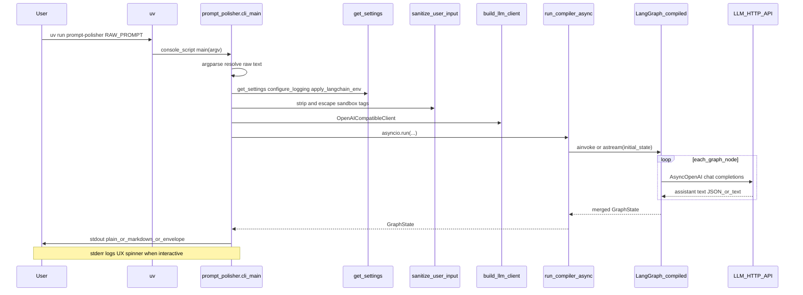
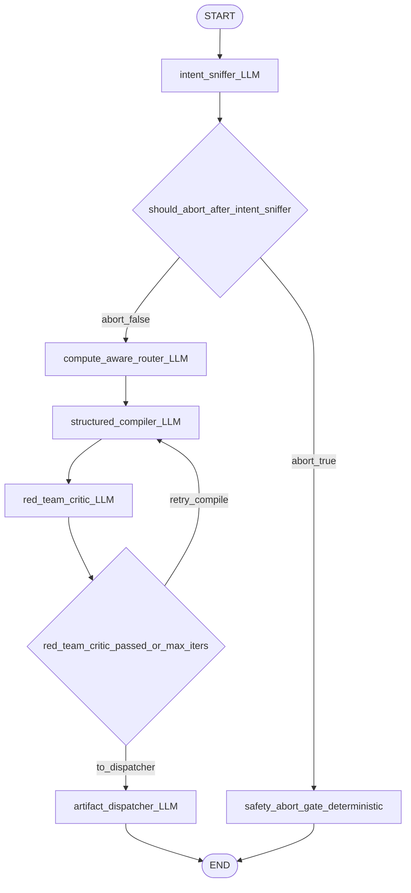
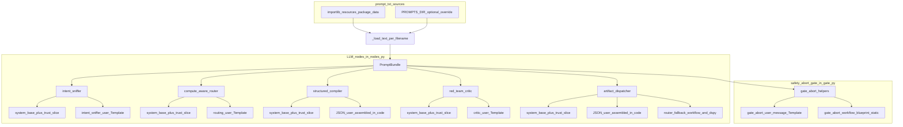
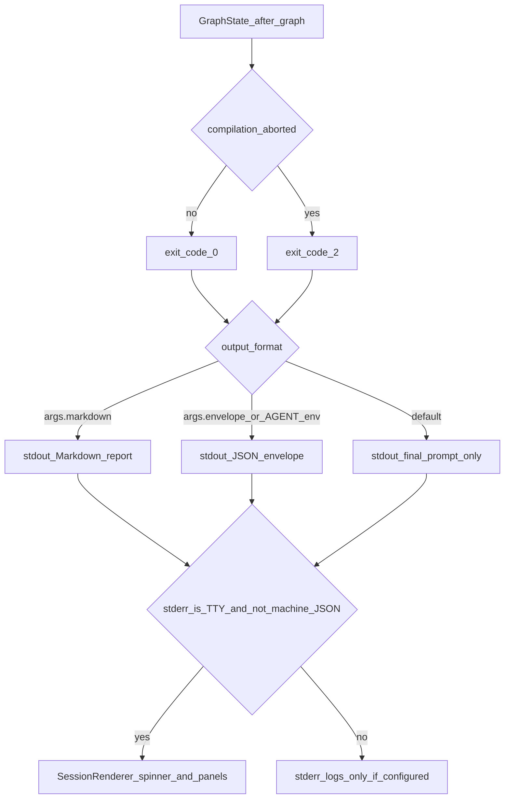
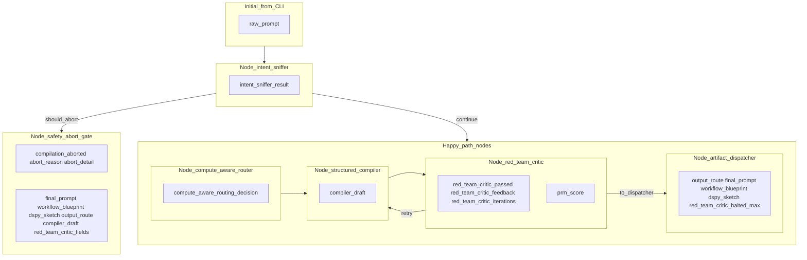

# CLI invocation flow (`uv run prompt-polisher`)

Mermaid views of the **default compile path** in [`cli.py`](../src/prompt_polisher/cli.py) (`main`): raw prompt → sanitizer → [`run_compiler_async`](../src/prompt_polisher/graph.py) → stdout. For product context see [README](../README.md); for theory see [`THEORY.en.md`](THEORY.en.md) / [`THEORY.zh.md`](THEORY.zh.md). **Keep this file aligned with code** when the CLI, graph, [`prompts/`](../src/prompt_polisher/prompts/), or [`GraphState`](../src/prompt_polisher/state.py) change. Other CLI exits (`--version`, `--serve`, `--agent-card`) are out of scope here.

---

## Diagram 1 — Sequence (CLI → graph → API → stdout)

Entry: [`pyproject.toml`](../pyproject.toml) → `prompt_polisher.cli:main`. Installed `prompt-polisher` on `PATH` is the same entrypoint.

---

## Diagram 2 — LangGraph control flow

[`should_abort_after_intent_sniffer`](../src/prompt_polisher/gate.py) drives `gate` (heuristic injection, threats, alignment flags). `afterCritic`: `red_team_critic_passed` or max iterations → `artifact_dispatcher`, else → `structured_compiler`. `safety_abort_gate` sets `compilation_aborted` and gate copy from [`prompts_bundle`](../src/prompt_polisher/prompts_bundle.py); no further LLM calls.

### Diagram 2b — `prompts/*.txt` per node

[`PromptBundle`](../src/prompt_polisher/prompts_bundle.py) (LRU key = resolved `PROMPTS_DIR`, else package data via `importlib.resources`). **System** / **user** are chat roles: **system** is the instruction stack from `*_system_*.txt`; **user** is the per-call payload (templates or JSON in [`nodes.py`](../src/prompt_polisher/nodes.py)). `_system_user` in that file appends the Pydantic JSON schema to **system** when the node expects structured output.

| Step | System | User | Extras |
| --- | --- | --- | --- |
| `intent_sniffer` | `intent_sniffer_system_*` | `intent_sniffer_user.txt` | — |
| `compute_aware_router` | `routing_system_*` | `routing_user.txt` | — |
| `structured_compiler` | `compile_system_*` | JSON in [`nodes.py`](../src/prompt_polisher/nodes.py) | — |
| `red_team_critic` | `critic_system_*` | `critic_user.txt` | PRM optional |
| `artifact_dispatcher` | `router_system_*` | JSON in `nodes.py` | Fallback: `router_fallback_workflow.txt`, `router_fallback_dspy.txt` |
| `safety_abort_gate` | — | `gate_abort_user_message.txt` | `gate_abort_workflow_blueprint.txt` |

`*_system_*` = `*_system_base.txt` + `*_system_trusted.txt` or `*_system_untrusted.txt`. Template fields for `*_user.txt` match the `PromptBundle` methods in [`prompts_bundle.py`](../src/prompt_polisher/prompts_bundle.py).

---

## Diagram 3 — Stdout format, exit code, stderr UX

Rich session on stderr is off when `_machine_json_stdout` is true (`--envelope` or `PROMPT_POLISHER_AGENT=1`, and not `--markdown`); see `_interactive` in `cli.py`.

---

## Diagram 4 — `GraphState` fields by node

| Stage | Keys |
| --- | --- |
| initial | `raw_prompt` |
| `intent_sniffer` | `intent_sniffer_analysis` |
| `safety_abort_gate` | abort fields, deliverables, `output_route`; clears draft/critic fields |
| `compute_aware_router` | `compute_aware_routing_decision` |
| `structured_compiler` | `compiler_draft` |
| `red_team_critic` | `red_team_critic_passed`, `red_team_critic_feedback`, `red_team_critic_iterations`; optional `prm_score` |
| `artifact_dispatcher` | `output_route`, `final_prompt`, `workflow_blueprint`, `dspy_sketch`, `red_team_critic_halted_max` |

`node_red_team_critic` may log `_critic_steps`; not in the typed `GraphState` ([`state.py`](../src/prompt_polisher/state.py)).
