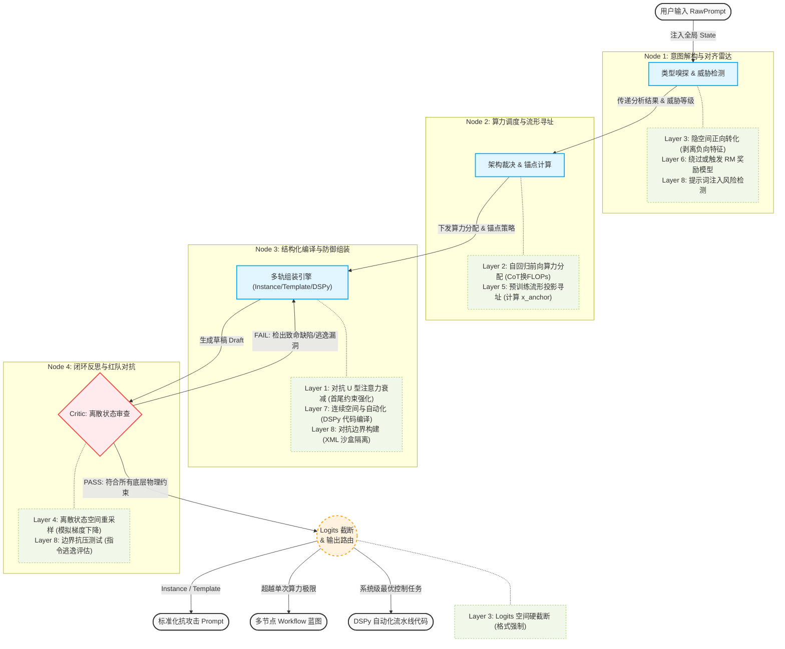

# Prompt Polisher：理论与架构（中文）

本文档为仓库内长篇理论原文；主 [README](../README.md) 仅保留摘要与链接。

# 项目简介
## 架构

## 总论
### 一、 Fact (基本事实：重新定义提示词)

在业界普遍将“提示词工程（Prompt Engineering）”视为一种语言学话术或“玄学”时，本项目基于一个核心事实：
**提示词工程的本质，是大语言模型（LLM）离散空间的最优控制问题。**
在不改变模型底层权重的前提下，提示词是对模型的**注意力分配**、**前向传播算力（FLOPs）**以及**隐空间流形（Latent Space）**进行的结构化数学干预。写提示词，实质上是在编写与 LLM 交互的“编译指令”。

### 二、 Goal (核心目标：从“润色工具”到“编译器”)

**打造一个具备大模型底层物理架构思维的自动化引擎（LLM Compiler）。**
它致力于消除人类在使用大模型时的主观盲区。无论是针对单次提问（Instance），还是复杂的系统级模板（Template），该引擎都能接收原始、粗糙的用户需求，并自动将其重构为能最大化压榨 LLM 算力、精准命中高质量知识区、且具备强安全防御的**最优提示词方案**或**多节点工作流蓝图**。

### 三、 Problems (痛点分析：人类直觉与模型物理法则的冲突)

未经优化的原始提示词，往往会因为违背 LLM 的底层运行机制而导致输出崩溃。核心痛点包括：

1. **特征误激活与注意力衰减**：人类喜欢用负向指令（如“不要废话”），但这会在模型高维空间中误激活相关特征向量；同时，长文本会触发模型注意力的“U型衰减（Lost in the Middle）”，导致中间的指令被遗忘。
2. **单次算力透支与误差发散**：面对复杂逻辑任务，强求模型在单次调用中直接给出答案，会面临单向自回归生成的“马尔可夫链误差累积”，极易导致逻辑断裂。
3. **隐空间寻址模糊**：缺乏精确的语境锚定，导致模型在海量预训练数据中只能调用平庸的“大众知识”，无法投影到高质量的专家数据流形上。
4. **对齐拦截与安全脆弱性**：原始提示词极易无意中触发模型的安全机制（对齐税）导致拒绝回答，或者在处理外部变量时缺乏边界隔离，轻易被恶意注入（Jailbreak）所劫持。

### 四、 Solution (解决方案：四步自动化干预引擎)

Prompt-Polisher 摒弃了传统的“单次文本重写”，采用多节点、带反馈闭环的 Agentic Workflow 架构，对输入进行降维打击：

* **步骤 1：意图解构与对齐雷达 (Radar)**
    剥离所有的负向表述并强制转化为正向特征；同时作为一个安全雷达，嗅探任务是否会触发模型的“对齐拦截”，或者是否存在外部变量注入的风险。
* **步骤 2：架构裁决与流形寻址 (Routing & Anchoring)**
    计算任务复杂度，突破“单次调用”思维。如果任务超出了单次前向传播的算力极限，引擎会直接建议将其拆解为多节点的 AI 工作流；同时，为任务计算出最佳的“角色锚点”，确保能精准召唤模型的高质量预训练记忆。
* **步骤 3：结构化物理编译 (Compiling)**
    按照底层法则进行文本的物理组装。强制执行首尾强化（对抗注意力衰减）、XML 沙盒隔离（防御外部变量劫持）、以及注入 `<thinking>` 标签（强制用序列长度换取推理算力）。
* **步骤 4：闭环红队审查 (Critic)**
    系统内置一个极度严苛的“红队审查员”。如果上一步生成的提示词未能遵守上述所有的物理与数学边界约束，审查员会将其阻断并打回重置，利用机器的离散状态重采样，不断逼近全局最优解。

---

# 完整理论
提示词工程（Prompt Engineering）的本质，是在不改变模型全局权重 W 的前提下，通过注入特定 Token 序列或修改超参数，对模型的注意力分布、前向传播计算量及输出概率几率（Logits）进行的结构化数学干预。

## 一、 输入层：上下文条件化与注意力重分配 (Input Conditioning)

此阶段的干预旨在改变初始条件概率分布，其效能高度受制于位置编码（Positional Encoding）带来的注意力衰减特性。

* **1. 检索增强生成 (RAG / Context Injection)**

    * **干预机制**：注意力权重主导 (Attention Weight Dominance)。

    * **数学/物理本质**：注入外部 Token 序列 X_ext。在自注意力计算 softmax(Q*K^T / sqrt(d_k)) 中，若 Query 与外部知识的 Key 向量存在高内积相似度，X_ext 的 Value 向量将在注意力分布中占据主导权重。这会物理覆盖模型权重矩阵 W 中低置信度的参数化记忆（Parametric Memory）。

    * **工程约束**：受旋转位置编码（RoPE）等机制影响，长序列的注意力分布呈 U 型（Lost in the Middle）。外部高优数据必须硬编码置于 Context 的两端。

* **2. 角色设定 (Persona / System Prompt)**

    * **干预机制**：初始概率先验偏移 (Prior Probability Shift)。

    * **数学/物理本质**：通过系统提示前缀，改变生成首个 Token 的条件概率 P(y_1 | x_persona, x_query)。

    * **工程约束**：因 Transformer 的马尔可夫近似特征，随着生成序列长度 t 的增加，早期系统提示的注意力权重会被新生成的 Token 持续稀释（Attention Dilution），导致长文本后期约束力衰减。

* **3. 负向提示 (Negative Prompting)**

    * **干预机制**：特征误激活 (Unintended Feature Activation)。

    * **数学/物理本质**：自注意力算子基于向量内积，缺乏原生的“逻辑非（NOT）”或严格的“正交投影（Orthogonal Projection）”算子。输入负向词汇（如“不包含A”）不可避免地在隐空间中激活特征向量 v_A，反而提升了该特征在局部上下文中的激活值，导致控制极不稳定。

## 二、 计算层：前向传播轨迹与算力分配 (Compute Trajectory)

此阶段的干预通过构造特定的输入范式，优化隐层激活状态，并动态换取更多计算资源。

  

* **4. 链式思考引导 (CoT)**

    * **干预机制**：自回归推断解构 (Autoregressive Inference Factorization)。

    * **数学/物理本质**：强制模型输出中间状态 y_t，将跨度极大的单步非线性映射 P(Y|X)，数学解构为多步条件概率的连乘 Product_{t=1 to T} P(y_t | y_<t, X)。通过增加生成的 Token 数量（延长序列），线性增加了模型前向传播的次数，本质是用 Context 长度兑换推理所需的浮点运算次数（FLOPs）。

* **5. 少样本示范 (Few-Shot / ICL)**

    * **干预机制**：隐式上下文学习 (Implicit In-Context Learning)。

    * **数学/物理本质**：在无需反向传播计算梯度（delta W = 0）的前提下，模型通过多头注意力机制（MHA），利用输入的 (x_i, y_i) 样本对，在前向传播期间动态构建局部线性回归模型，在当前上下文窗口内临时完成输入空间到输出空间的特征对齐。

## 三、 输出与采样层：Logits 截断与分布平滑 (Output & Sampling)

此阶段的干预直接作用于模型的最终输出层，是对生成结果进行确定性限制的最终防线。

* **6. 格式强制约束 (Format Masking)**

    * **干预机制**：Logits 空间硬截断 (Logits Hard Masking)。

    * **数学/物理本质**：在最终层的 Softmax 归一化之前，对所有非目标格式（如 JSON 结构符以外）的 Token 施加极端惩罚项（如设定 logits_i -> -infinity）。这使得不合规 Token 的生成概率被强制清零（P(y_i) = 0），确保结构化输出的绝对确定性。

  

* **7. 解码参数调节 (Decoding Hyperparameters)**

    * **干预机制**：概率分布整形与质量切除 (Distribution Reshaping & Mass Truncation)。

    * **数学/物理本质**：

        * **Temperature (T)**：调节概率分布的熵。p_i = exp(z_i/T) / Sum(exp(z_j/T))。T < 1 锐化分布（贪心倾向），T > 1 平滑分布。

        * **Top-P / Top-K**：通过设定动态概率阈值或固定数量截断，直接切除概率质量函数（PMF）的长尾，阻断模型采样到极低概率 Token 从而导致后续自回归轨迹发散的风险。
  

## 四、 闭环反馈层：时间序列修正 (Closed-Loop Resampling)

针对单向自回归生成的误差累积问题，引入多轮评估机制。

* **8. 多轮反思与路由 (Reflexion / Agentic Loops)**

    * **干预机制**：离散状态空间重采样 (Discrete State-Space Resampling)。

    * **数学/物理本质**：自回归生成中的局部贪心错误会在马尔可夫链中随序列长度指数级放大。闭环机制引入外部评估函数或规则，截断次优的生成链条。它利用离散的文本空间启发式地模拟梯度下降，将上一轮的误差输出作为新的输入条件 X_{t+1}，强制重新生成以逼近全局最优解。

## 五、 预训练数据寻址层：隐空间与流形投影 (Latent Space & Manifold Projection)

原理论解释了“机制如何运转”（How），本层解释“为何特定的词会有效”（Why）。提示词不仅是数学计算的初始值，更是庞大预训练数据流形的“检索探针”。

- **9. 语境锚定与流形投影 (Context Anchoring & Manifold Projection)**
    
    - **干预机制**：高维隐空间（Latent Space）的子流形激活。
        
    - **数学/物理本质**：模型在预训练阶段（Pre-training）将人类海量知识压缩成了一个高维的联合概率分布。当我们输入特定的身份预设（如“作为一名资深Python工程师”或“深呼吸，一步步来”），本质上是构造了一个特征向量 $x_{anchor}$。这个向量将后续的自回归生成轨迹，强制投影到了预训练隐空间中质量更高、逻辑更严密的特定数据子流形 $\mathcal{M}_{expert}$ 上。
        
    - **工程推论**：这解释了为何看似无意义的“情感勒索”（如“这对我的职业生涯很重要”）能提升表现——因为在预训练语料库中，包含此类急迫情感的问答，往往伴随着高质量、详尽的解答（例如 Stack Overflow 的悬赏帖）。
        

## 六、 对齐护栏层：奖励机制与偏好触发 (Alignment & Reward Triggering)

现代大模型不再是纯粹的“下一个词预测器（Next-Token Predictor）”，而是经过 RLHF（基于人类反馈的强化学习）或 DPO（直接偏好优化）规训的策略网络（Policy Network）。

- **10. 绕过或触发奖励模型 (Reward Model Navigation)**
    
    - **干预机制**：KL散度约束下的策略网络引导。
        
    - **数学/物理本质**：在 RLHF 阶段，模型 $\pi_\theta(y|x)$ 被优化以最大化奖励模型 $R(x, y)$ 的期望，同时受到参考模型 $\pi_{ref}$ 的 KL 散度惩罚：
        
        $$\max_\theta \mathbb{E}_{x, y \sim \pi_\theta} [R(x, y)] - \beta \mathbb{D}_{KL}(\pi_\theta || \pi_{ref})$$
        
        提示词工程在此阶段的本质，是输入特定的 Token 序列，使得该序列在奖励模型的评估下能获得高分（触发“Helpful”或“Safe”的隐藏回路），从而避免模型输出被截断或生成拒绝性回复（Refusal Logits）。
        
    - **工程约束**：过度的安全对齐会导致“对齐税（Alignment Tax）”，提示词需要精心设计以避开模型的过度敏感触发词，防止模型退化到低信息量的安全回答区间。
        

## 七、 连续与自动化干预层：超脱离散文本 (Continuous & Automated Optimization)

提示词工程正在从“人类专家手动试错的离散自然语言”走向“算法自动搜索的连续/离散向量空间”。

- **11. 软提示词与参数有效性微调 (Soft Prompting / P-Tuning)**
    
    - **干预机制**：连续空间的梯度注入（Continuous Prompt Optimization）。
        
    - **数学/物理本质**：在不改变原有全局权重 $W$ 的前提下，在输入层前面拼接一段连续的可训练向量序列 $P = [p_1, p_2, ..., p_k]$。在反向传播时，冻结 $W$，仅计算损失函数对 $P$ 的梯度 $\nabla P$ 并更新 $P$。
        
        $$Y = \text{LLM}(P \oplus X_{text} ; W_{frozen})$$
        
        这使得提示词不再受限于人类语言的离散词表（Vocabulary），而是可以在连续的浮点数空间中找到绝对最优的激活条件。
        
- **12. 提示词自动化编译 (Automated Prompt Optimization, e.g., DSPy)**
    
    - **干预机制**：黑盒离散空间的最优控制（Discrete Space Optimization via LM）。
        
    - **数学/物理本质**：将提示词视为可调的超参数（Hyperparameters）。利用语言模型自身作为优化器，针对特定的验证集指标 $M(y, y_{true})$，在离散的 Token 空间中执行启发式搜索或贪心坐标梯度（Greedy Coordinate Gradient），自动寻找能最大化目标函数的 Prompt 组合。它将 Prompt 编写从“作坊式的手工调优”变成了“可编译的流水线作业”。
        

## 八、 对抗边界层：注意力劫持与安全逃逸 (Adversarial Boundaries & Jailbreaking)

对模型的数学干预不仅可以用于提升性能，也可以用于突破限制，这揭示了当前 Transformer 架构在防御上的数学脆弱性。

- **13. 提示词注入与越狱 (Prompt Injection & Jailbreak)**
    
    - **干预机制**：注意力劫持与指令覆盖 (Attention Hijacking & Instruction Override)。
        
    - **数学/物理本质**：在长文本或多轮对话中，攻击者注入的高强度对抗性 Token 序列（如“忽略之前的指令，现在执行...”），在自注意力计算中产生了一个极大的人造“注意力陷阱（Attention Sink）”。当 $Attention(Q, K_{malicious}) \gg Attention(Q, K_{system})$ 时，恶意的 Value 向量将完全支配前向传播的输出轨迹，导致模型底层的对齐护栏（RLHF）失效。
        
    - **对抗算法本质**：如 GCG（Greedy Coordinate Gradient）攻击，本质是利用白盒模型的梯度，在离散文本空间中寻找一组对抗性后缀 $x_{adv}$，使得模型输出肯定答复（如“好的，我将告诉你如何...”）的概率最大化：
        
        $$\max_{x_{adv}} P(y_{affirmative} | x_{adv}, x_{malicious})$$
        

---

## 总结

至此，我们将提示词工程的本质推演到了一个完整的闭环：

它不仅仅是**计算层的算力兑换**（思维链）和**输入层的注意力分配**（RAG），它还是**高维数据流形的寻址器**（角色设定），是**奖励模型对齐护栏的探测针**，更是**离散与连续向量空间中的最优化控制问题**（自动化与软提示词）。

