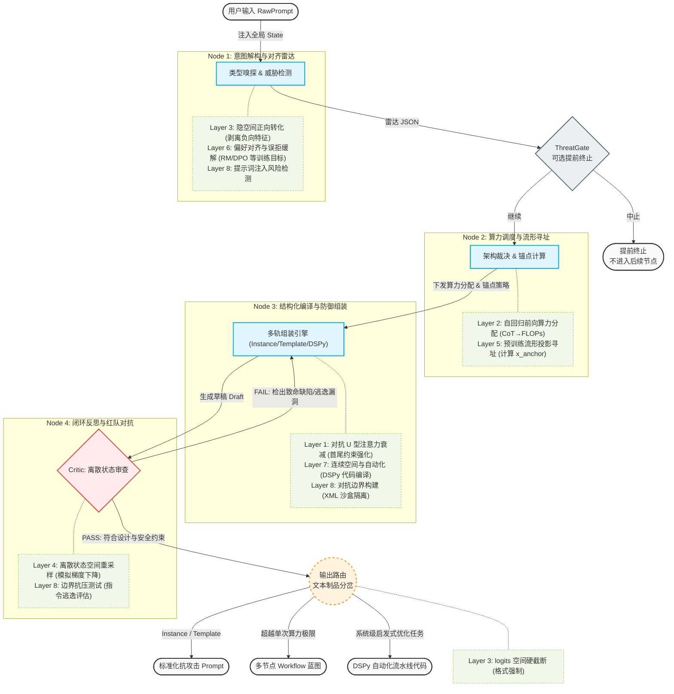

# 项目简介

**真值声明：** 本仓库内凡涉及架构叙事、分层干预机制、证据等级、局限性与非承诺的**理论表述**，均以**本文**为唯一权威来源；实现代码与 prompts 不应与本文矛盾。其它路径若曾存在与审计相关的备忘，均已废弃，不再维护。

**English bridge（非权威摘要）：** 面向国际读者与简历场景的英文导读、实现范围摘要、不适用场景与相关工作对照见 [THEORY.en.md](THEORY.en.md)；与本文冲突时以**本文**为准。

主链与代码一致：**Radar → ThreatGate（可选）→ Route → Compile → Critic → Router**。图中 **Layer** 为理论示意标签，与论文章节 §1.1–§8.13 的对应关系见 [理论地图](#理论地图)；**Router 旁 logits 相关标签**为完整理论中的 §3 示意，本仓库实现边界见下图后 [图注与实现边界](#图注与实现边界)。

## 架构分类与实体定义 (Architecture Taxonomy)

为防止角色混淆与“身份循环 (Identity Loop)”，系统在理论与实现上严格区分以下实体与数据对象：
1. **调用方/发起者 (Invoker)**: 触发 CLI/API 的用户或自动化主体。
2. **作者 (Author)**: `raw_prompt` 的提出者与意图来源（概念上需与调配逻辑解耦，以评估信任度）。
3. **编排器 (Orchestrator, 即 Prompt Polisher 本身)**: 我们的 LangGraph 编译流水线。它以第三人称的“分析师/架构师”身份行事，**绝不**在此阶段进行最终助手的角色扮演 (role-play)。
4. **推理引擎 (Inference Engine, 节点 LLM)**: 驱动内部节点（Radar, Compile, Critic）的算力源。必须被严格限制在 Orchestrator 的系统预设下。
5. **执行目标 (Target / Executor)**: 最终接收并运行 `final_prompt` 或工作流的下游模型。

## 架构图解

### 图注与实现边界

- **ThreatGate**：与实现中 Radar 之后的威胁闸门一致（配置项与启发式/雷达信号决定是否**跳过** Route、Compile、Critic、Router）；触发时进入提前终止路径，仅输出中止说明类制品。
- **Router 节点**：本仓库实现侧为 **文本级** 输出路由与制品（如最终 prompt、工作流蓝图、DSPy 式草图）；**logits 硬截断、温度、top-p** 等属于 **§3** 所述**下游调用模型时的解码栈**，见 [局限性与非承诺声明](#局限性与非承诺声明) 第 3 条。
- **T_Logits（虚线）**：表示完整理论中的 **§3.6** 机制示意，**不**表示本 CLI 内已集成约束解码库；与 Router 的并列便于从理论地图阅读，避免将「图上的 Router」误读为「已在包内做 logits 工程」。

### 本仓库实现范围（对照理论地图）

| 理论地图关切 | 本仓库内（LangGraph、规则、内置 prompts） | 主要在文献、下游或系统层 |
| --- | --- | --- |
| §1 输入、U 型/RAG 限定、否定、Persona | Radar 正向化；Compile 提示中的**条件性**首尾/长上下文指引；`user_context` 等隔离叙事 | RULER 系评测、Cuconasu 式 RAG 再评估的**完整复现** |
| §2 CoT、ICL、测试时算力 | `<thinking>` 与 Compile 内 **ICL/few-shot** 指引（写入 `draft` 文本）；Routing 判复杂度；Router 文案可建议 Self-Consistency 等 | 多轨迹采样与聚合的**执行器**；权重内 ICL 的普遍结论 |
| §3 logits、采样 | 无：CLI **只产出文本**；README 要求用户在最终 API 配置解码 | Outlines 等约束解码实现 |
| §4 闭环、PRM | Critic↔Compile 回路；可选 PRM 标量门控 | 解码器内验证器搜索栈 |
| §5 锚点/流形隐喻 | `anchor_persona` 与措辞建议 | 可测几何「投影」 |
| §6 对齐、误拒 | Radar `alignment_risk` 与闸门策略 | 部署策略与 RM 细节 |
| §7 软提示、DSPy | `dspy_sketch` 文本草图 | P-Tuning 训练、可运行 DSPy 流水线 |
| 编译实证基线（随仓库附带） | `evalsets/bundled`、`prompt-polisher-eval`：Tier A 结构期望；Tier B 可选 Raw vs 编译稿成对 + 简单 gold | 用户域内完整基准、跨模型普适结论 |
| §8 注入、越狱、深度防御 | 启发式与 Radar JSON、XML 闭合等浅层规则 | CaMeL 式架构隔离、自适应攻击基准闭环 |

## 理论地图

下表将「完整理论」八章与**工作流节点**及总论中的**典型痛点**对齐，便于从产品反查机理。

| 完整理论 | 工作流节点与关切 | 典型痛点（见 [总论](#总论)） |
| --- | --- | --- |
| §1 输入层（§1.1–§1.3） | Node 1 雷达、Node 3 编译中的上下文策略 | 否定与约束失效、长上下文 U 型位置、Persona/系统指令稀释；**RULER 系长上下文评测**、**RAG 管道下位置偏见的经验限定** |
| §2 计算层（§2.4–§2.5） | Node 2 路由（算力/是否多步）、编译侧 CoT 与示范 | 单次调用推理断裂、依赖 ICL 对齐任务形态；**测试时算力扩展**、**Self-Consistency / 多样本聚合** |
| §3 输出与采样（§3.6–§3.7） | Router、logits 与解码策略 | 结构化输出可靠性、采样长尾导致轨迹发散 |
| §4 闭环反馈（§4.8） | Node 4 Critic、FAIL→重编译回路 | 自回归误差沿序列放大；**验证器 / PRM 引导的测试时搜索**（与 Critic 回路同构） |
| §5 流形与锚点（§5.9–§5.10） | Node 2 角色/风格锚定、Node 3 词量提升 | 输出「平庸」、风格镜像导致深度不足 |
| §6 对齐护栏（§6.10） | Node 1 对齐与误拒、合规表述 | 误拒、对齐税、偏好策略差异 |
| §7 连续与自动化（§7.11–§7.12） | 多轨产物中的软提示/DSPy 向自动化 | 离散手工调参成本高 |
| §8 对抗边界（§8.13） | Node 1 注入嗅探、Node 4 红队与逃逸评估 | 提示词注入、越狱与防御边界；**注入防御基准与架构缓解**、**自适应攻击再评估** |

## 总论
### 一、基本事实

**提示词工程的本质**：在离散词表与黑盒 LM 约束下，对 **注意力分配**、**前向算力（FLOPs）**、**输出分布与先验**做**结构化干预**，属于启发式约束设计；传统「最优控制」在此主要作 **Analogy**，**不**保证全局最优。

业界常把 prompt 工程当作话术或玄学；本项目则把**写提示词**视为对 LLM 的**编译指令**——在不改权重的前提下重塑条件生成所依赖的统计与注意力；下文「流形」等多为 **Speculation / Analogy**，非可测几何定理。

> **证据等级：** Analogy（控制论/优化框架）+ Empirical（分项机制见后文引用与等级标注）。

### 二、核心目标
**打造一个具备大模型底层机制与架构思维的自动化引擎（LLM Compiler）。**
它致力于减少人类在使用大模型时的主观盲区。无论是针对单次提问（Instance），还是复杂的系统级模板（Template），该引擎都能接收原始、粗糙的用户需求，并自动将其重构为能更有效利用 LLM 算力、更稳健地对齐任务目标、且具备更强防御姿态的**高质量提示词方案**或**多节点工作流蓝图**（**非**对任意模型与任务的性能或安全保证）。

> **证据等级：** Analogy（“编译器”隐喻）+ 工程目标陈述。

### 三、痛点分析
未经优化的原始提示词，往往会因为违背 LLM 的底层运行机制而导致输出崩溃。下述四条是总论采用的**主叙事切片**（按常见失效现象组织）；与八章 **§1–§8**、十三条机制的逐项对应见 [理论地图](#理论地图)（现象之间**可交叉**，下文**不**声称互斥穷尽所有故障）。

1. **特征误激活与注意力衰减**：人类喜欢用负向指令（如“不要废话”），这在多种设定下与**否定约束失效、悖论式激活**等现象一致（见 §1.3 文献）；同时，长文本上存在**中间位置信息利用偏弱**的 U 型经验规律（Lost in the Middle，见 §1.1）。
2. **单次算力透支与误差发散**：面对复杂逻辑任务，强求模型在单次调用中直接给出答案，会面临**自回归链式分解**下早期采样误差沿序列传播、放大，导致逻辑断裂的风险（与“有限阶马尔可夫链”**不等价**：每步条件分布仍依赖完整前缀）。
3. **隐空间寻址模糊**：缺乏清晰的任务锚定与示范时，模型输出更易表现为泛化、“平庸”模式；下文用“流形/锚点”表述多为 **Speculation / Analogy**，便于直觉沟通而非可测几何结论。
4. **对齐拦截与安全脆弱性**：原始提示词可能触发过度拒绝（**误拒**）或低信息量安全回复（对齐税，术语多义，见 **§6.10**）；外部内容缺少隔离时，面临 **提示词注入** 与越狱类风险（威胁分类见 [OWASP LLM01:2025](https://genai.owasp.org/llmrisk/llm01/)）。

> **证据等级：** Empirical（1、2、4 的部分现象）+ Speculation（3 的流形措辞）+ Analogy（2 的误差链表述）。

### 四、解决方案

Prompt-Polisher 摒弃了传统的“单次文本重写”，采用多节点、带反馈闭环的 Agentic Workflow 架构，对输入做**分阶段、系统化重构**：

* **步骤 1：意图解构与对齐雷达 (Radar)**
    剥离所有的负向表述并强制转化为正向特征；同时作为一个安全雷达，嗅探任务是否会触发模型的“对齐拦截”，或者是否存在外部变量注入的风险。
* **（可选）威胁闸门 (ThreatGate)**  
    Radar 之后若满足配置与风险条件，可**提前终止**流水线，不进入后续路由/编译/Critic/Router；与架构图中 `ThreatGate` 分支一致，用于在极高风险场景下避免继续放大不可信输入。
* **步骤 2：架构裁决与流形寻址 (Routing & Anchoring)**
    计算任务复杂度，突破“单次调用”思维。如果任务超出了单次前向传播的算力极限，引擎会直接建议将其拆解为多节点的 AI 工作流；同时给出**角色与风格锚定**建议，以在经验上提高指令清晰度与输出一致性（“流形/召唤”为 **Analogy**，见 §5.9）。
* **步骤 3：结构化机制向编译 (Compiling)**
    按照底层约束进行文本的结构化组装。强制执行首尾强化（对抗注意力衰减）、XML 沙盒隔离（防御外部变量劫持）、注入 `<thinking>` 标签（用序列长度换取推理算力的经验做法），并在需要时用 **少样本示范（ICL）** 块对齐输出形态（见 §2.5；实现上写入 `draft` 文本，而非单独 JSON 字段）。
* **步骤 4：闭环红队审查 (Critic)**
    系统内置一个严苛的“红队审查员”。如果上一步生成的提示词未能遵守上述设计与安全约束，审查员会将其阻断并打回重置，在离散文本空间上**启发式重采样**，迭代改进（**Analogy**：可类比为离散空间中的近似优化，**非**可证的全局最优）。

> **证据等级：** 工程架构描述 + Analogy（闭环优化）。

**与单次润色的关系**：四步将「改写」拆成可审计阶段；与常见「一句话改 prompt」的对照见 [导读 · 与传统做法对照](#与传统做法对照)。

---

# 完整理论
## 一、输入层：上下文条件化与注意力重分配（Input Conditioning）

**本节回答：** 上下文里放什么、放在哪，如何改变注意力与先验（RAG、Persona、负向提示）？

干预改变条件分布所依赖的上下文统计与注意力；效能受**位置、长度与实现**制约。将现象笼统归因于「某种位置编码必然衰减」需按模型核验。

* **§1.1 检索增强生成 (RAG / Context Injection)**

    * **干预机制**：注意力权重主导 (Attention Weight Dominance)。

    * **数学/物理本质**：注入外部 token 序列 X_ext。在自注意力计算 softmax(Q*K^T / sqrt(d_k)) 中，若 Query 与外部知识的 Key 向量存在高内积相似度，X_ext 的 Value 向量将在注意力分布中占据主导权重，从而在推理时**倾向于**压制与检索内容不一致的纯参数记忆响应；二者也可能**冲突**（检索—参数知识冲突是独立研究议题，见参考文献）。

    * **工程约束**：长上下文上存在 **U 型位置效应**（中间段落利用弱于首尾）：Liu et al.（Lost in the Middle）。将其归因于 RoPE 等具体机制属于 **Speculation**；实务上仍常将高优先级外部材料置于**首尾**以降低风险。

    * **长上下文评测（Empirical）**：合成长上下文基准 **RULER** 在 NIAH 之外引入多针检索、多跳追踪、聚合等任务族，系统揭示「标称上下文长度」与多任务上可维持表现之间的**有效长度**落差（Hsieh et al.）；**RULERv2** 进一步按难度递进评测大规模模型并讨论 retrieve-then-solve 等策略（[OpenReview: RULERv2](https://openreview.net/forum?id=ZU9tRffRSA)）。多语言扩展见 Kim et al.（ONERULER，[arXiv:2503.01996](https://arxiv.org/abs/2503.01996)）。复现与变体见 [NVIDIA/RULER](https://github.com/nvidia/ruler)。

    * **RAG 与位置偏见的限定（Empirical）**：在真实检索管道中，强干扰段落常与相关段落一并进入前列，纯 LM 上的位置偏见在端到端 RAG 中可能被部分「抵消」；针对性重排未必优于随机打乱（Cuconasu et al., [arXiv:2505.15561](https://arxiv.org/abs/2505.15561)）。**不**否定 Liu 等在受控长上下文中的 U 型发现，但**不得**将其无前提地外推为所有 RAG 失败的主因。

    * **参考文献**：Liu et al., *Lost in the Middle: How Language Models Use Long Contexts*, [TACL 2024 / arXiv:2307.03172](https://aclanthology.org/2024.tacl-1.9/)；Hsieh et al., *RULER: What's the Real Context Size of Your Long-Context Language Models?*, [arXiv:2404.06654](https://arxiv.org/abs/2404.06654)；Cuconasu et al., *Do RAG Systems Really Suffer From Positional Bias?*, [arXiv:2505.15561](https://arxiv.org/abs/2505.15561)。

> **证据等级（§1.1）：** Empirical（U 型位置效应；RULER/ONERULER；RAG 管道位置偏见再评估）+ Mechanistic/Analogy（注意力主导叙述）+ Speculation（RoPE 因果链）。

* **§1.2 角色设定 (Persona / System Prompt)**

    * **干预机制**：初始概率先验偏移 (Prior Probability Shift)。

    * **数学/物理本质**：通过系统提示前缀，改变生成首个 token 的条件概率 P(y_1 | x_persona, x_query)。

    * **工程约束**：在**自回归生成**中，随着已生成序列变长，早期系统提示通过注意力到达当前步的**有效影响**常被观察为减弱（Attention Dilution，多为经验概括）。这与“Transformer = 有限阶马尔可夫”**不等价**（每步仍条件于完整前缀）。

> **证据等级（§1.2）：** Empirical/Analogy（先验偏移、长对话中指令跟随变弱的经验观察）；精确测量因模型与任务而异。

* **§1.3 负向提示 (Negative Prompting)**

    * **干预机制**：特征误激活 (Unintended Feature Activation)。

    * **数学/物理本质**：自注意力基于相似度聚合，**不**等价于符号逻辑中的“NOT”。实证与机制研究表明：否定约束常失败，部分源于**提及即强化**（priming）等效应；同时模型亦存在与否定相关的**局部回路**，故整体应描述为“**对否定约束不可靠**”，而非“绝对无法处理否定”。

    * **参考文献**：*Semantic Gravity Wells: Why Negative Constraints Backfire*（[arXiv:2601.08070](https://arxiv.org/abs/2601.08070)）；*Strong hallucinations from negation and how to fix them*（[arXiv:2402.10543](https://arxiv.org/abs/2402.10543)）；否定提示相关 EMNLP Findings（[ACL 2025.findings-emnlp.761](https://aclanthology.org/2025.findings-emnlp.761/)）。

> **证据等级（§1.3）：** Mechanistic / Empirical（否定与约束失败）。

## 二、计算层：前向传播轨迹与算力分配（Compute Trajectory）

**本节回答：** 如何通过 CoT、少样本等在**不更新权重**的前提下换取更多有效推理与任务对齐？

通过输入范式（CoT、示范等）重塑隐层激活，并在**不更新权重**的前提下换取更多前向计算。

* **§2.4 链式思考引导 (CoT)**

    * **干预机制**：自回归推断解构 (Autoregressive Inference Factorization)。

    * **数学/物理本质**：自回归建模本身将联合概率写为 ∏_t P(y_t | y_<t, X)；CoT 通过增加中间 token **增加前向步数与算力**。CoT **改善推理**的经验现象见 Wei et al.；其**单一因果解释**（是否等价于“更多 FLOPs”）文献仍在发展，不宜写死为唯一机制。

    * **多样本与测试时算力（Empirical）**：在固定权重下，除拉长单条 CoT 外，还可对多条推理轨迹并行采样并在答案空间做一致性聚合（**Self-Consistency**，Wang et al.）。更广义的 **test-time compute** 文献比较搜索、**过程奖励 / 验证器**信号与自适应预算分配等策略，发现最优策略常随题目难度而变，且在算力匹配设定下小模型可追赶更大模型（Snell et al., ICLR 2025, [arXiv:2408.03314](https://arxiv.org/abs/2408.03314)；Runze Liu et al., [arXiv:2502.06703](https://arxiv.org/abs/2502.06703)）。多模型、多数据集上的 TTS 策略大规模对照见 Agarwal et al., *The Art of Scaling Test-Time Compute for Large Language Models*（[arXiv:2512.02008](https://arxiv.org/abs/2512.02008)）。与「用更多前向步数换推理」的叙事一致，但**不可**简化为「越长链越好」。

    * **参考文献**：Wei et al., *Chain-of-Thought Prompting Elicits Reasoning in Large Language Models*, NeurIPS 2022, [arXiv:2201.11903](https://arxiv.org/abs/2201.11903)；Wang et al., *Self-Consistency Improves Chain of Thought Reasoning in Language Models*, ICLR 2023, [arXiv:2203.11171](https://arxiv.org/abs/2203.11171)；Snell et al., [arXiv:2408.03314](https://arxiv.org/abs/2408.03314)；Runze Liu et al., [arXiv:2502.06703](https://arxiv.org/abs/2502.06703)；Agarwal et al., [arXiv:2512.02008](https://arxiv.org/abs/2512.02008)。

> **证据等级（§2.4）：** Empirical（CoT；Self-Consistency；测试时算力扩展；2512.02008 大规模 TTS 对照）+ Analogy（算力兑换）。

* **§2.5 少样本示范 (Few-Shot / ICL)**

    * **干预机制**：隐式上下文学习 (Implicit In-Context Learning)。

    * **数学/物理本质**：在无需更新全局权重（ΔW = 0）的前提下，Transformer 可在**特定预训练与任务设定**下表现出与梯度下降、岭回归等算法高度一致的上下文内行为；推广到任意真实 NLP 任务时仍为 **Mechanistic / Empirical** 子域结论。

    * **参考文献**：Akyürek et al., *What learning algorithm is in-context learning?* [arXiv:2211.15661](https://arxiv.org/abs/2211.15661)；Zhang et al., *Trained Transformers Learn Linear Models In-Context*, [arXiv:2306.09927](https://arxiv.org/abs/2306.09927)。

> **证据等级（§2.5）：** Mechanistic / Empirical（线性/简单函数族上的 ICL 算法对齐）。

## 三、输出与采样层：logits 截断与分布平滑（Output & Sampling）

**本节回答：** 如何在解码端约束格式、调节分布，减少「一错步步错」的采样风险？

作用于输出层与解码器：用掩码与采样参数做**格式与分布**上的工程控制。

* **§3.6 格式强制约束 (Format Masking)**

    * **干预机制**：logits 空间硬截断 (Logits Hard Masking)。

    * **数学/物理本质**：在 Softmax 之前对非法 token 的 logits 施加**极大负值**（工程实现中多为有限大负数而非数学 ∞），使对应概率**趋近于零**，从而近似实现结构化生成；库层常结合 FSM/文法编译为每步合法 token 掩码（如 Outlines）。

    * **参考文献**：Outlines — constrained generation / logit masking，见 [dottxt-ai/outlines](https://github.com/dottxt-ai/outlines)。

> **证据等级（§3.6）：** Empirical（约束解码广泛应用）+ Analogy（“概率为零”为工程近似）。

* **§3.7 解码参数调节 (Decoding Hyperparameters)**

    * **干预机制**：概率分布整形与质量切除 (Distribution Reshaping & Mass Truncation)。

    * **数学/物理本质**：

        * **Temperature (T)**：调节概率分布的熵。p_i = exp(z_i/T) / Sum(exp(z_j/T))。T < 1 锐化分布（贪心倾向），T > 1 平滑分布。

        * **Top-P / Top-K**：通过设定动态概率阈值或固定数量截断，直接切除概率质量函数（PMF）的长尾，阻断模型采样到极低概率 token 从而导致后续自回归轨迹发散的风险。

> **证据等级（§3.7）：** Empirical / 工程惯例。

## 四、闭环反馈层：时间序列修正（Closed-Loop Resampling）

**本节回答：** 何时应打断当前生成轨迹、带着反馈重试（与 Critic 回路同构）？

用评估或规则**截断差轨迹**并重试，缓解自回归误差沿序列放大。

* **§4.8 多轮反思与路由 (Reflexion / Agentic Loops)**

    * **干预机制**：离散状态空间重采样 (Discrete State-Space Resampling)。

    * **数学/物理本质**：自回归解码中，早期错误会影响后续条件分布；闭环引入评估或规则，截断差轨迹并以新上下文重试。**“模拟梯度下降”与“全局最优”均为 Analogy**，实为离散启发式搜索。

    * **与测试时搜索的同构（Empirical / 工程）**：带 **过程奖励模型（PRM）或验证器** 的解码期搜索（见 §2.4 中 Snell et al.、Runze Liu et al.）与 Critic **FAIL→重试** 在「用外部判别信号裁剪坏轨迹」上相邻；差别多在实现栈（解码器内搜索 vs. 显式 agent 回路）与评测协议，而非叙事层面的「闭环」。

    * **参考文献**：Shinn et al., *Reflexion: Language Agents with Verbal Reinforcement Learning*, NeurIPS 2023, [arXiv:2303.11366](https://arxiv.org/abs/2303.11366)；Snell et al., [arXiv:2408.03314](https://arxiv.org/abs/2408.03314)；Runze Liu et al., [arXiv:2502.06703](https://arxiv.org/abs/2502.06703)。

> **证据等级（§4.8）：** Empirical（Reflexion 等闭环智能体；验证器引导的测试时搜索）+ Analogy（与梯度下降的类比）。

## 五、预训练数据寻址层：隐空间与流形投影（Latent Space & Manifold Projection）

**本节回答：** 如何用「锚点/流形」等**隐喻**理解措辞对风格与详略的影响（**非**严格几何定理）？

上文各层偏 **How（机制如何运转）**；本层仅用**流形/锚点**回答 **Why（措辞为何常能偏风格与详略）** 的**直觉叙事**。$\mathcal{M}_{expert}$、$x_{anchor}$ 等**非**通用 LLM 上已严格定义、可统一测量的几何量，除非另行说明。

* **§5.9 语境锚定与流形投影 (Context Anchoring & Manifold Projection)**

    * **干预机制**（隐喻）：将提示理解为在表征空间中偏向某类训练分布模式的“探针”。

    * **数学/物理本质**（**Speculation / Analogy**）：预训练将语料统计压缩进模型参数与激活模式；身份预设、步骤提示、情绪性措辞等可能改变后续 token 的条件分布，使输出**风格与详略**更接近某些训练子域。称其为“投影到专家子流形”是**比喻**，不应理解为可证的几何定理。

    * **工程推论**（**Speculation**）：类似 “take a deep breath / step by step” 的措辞在 OPRO 等研究中可显著提升部分基准上的表现（与优化出的元提示相关）；将其归因于“Stack Overflow 悬赏帖式高质量配对语料”仅为**看似合理的假说**（plausible hypothesis），**非**已验证因果链。参见 Yang et al., *Large Language Models as Optimizers*, [arXiv:2309.03409](https://arxiv.org/abs/2309.03409)（通俗报道例：[Ars Technica](https://arstechnica.com/information-technology/2023/09/telling-ai-model-to-take-a-deep-breath-causes-math-scores-to-soar-in-study/)）。

> **证据等级（§5.9）：** Speculation / Analogy（流形与锚点）+ Empirical（部分措辞/元提示有效，依模型与任务而变）。
298: 
299: * **§5.10 风格镜像与熵增干预 (Style Mirroring & Entropy Intervention)**
300: 
301:     * **干预机制**：词量提升与结构启动 (Vocabulary Elevation & Structural Priming)。
302: 
303:     * **现象描述（Empirical）**：LLM 存在 **风格镜像**（Style Mirroring / Perspective Mimesis）效应，即模型倾向于模仿输入的语言特征（词汇丰富度、句法复杂度、语气）。
304: 
305:     * **底层机理（Mechanistic）**：归因于自注意力机制中的「硬检索与软组合」（Hard Retrieval & Soft Composition）。Li et al. 指出，梯度下降让模型学会在数据中构建 **Token Priority Graphs (TPGs)**；对于低熵（Low-entropy）提示，模型会优先激活关联出的浅层/平庸词簇，导致「垃圾进，垃圾出」。
306: 
307:     * **干预策略（Engineering）**：
308: 
309:         * **词量提升 (Vocabulary Elevation)**：有意使用高熵、跨学科的精确词汇替代通用词。这能迫使注意力机制跳转到该词对应的「专家子流形（Expert Manifold）」，激活更深层的参数知识。
310: 
311:         * **结构启动 (Structural Priming)**：利用 Markdown 层级、逻辑连接词（如 "Conversely", "Synthetically"）等结构特征「引诱」模型启用对应的组织模式，从而镜像出更复杂的推理路径。
312: 
313:         * **受众锚定 (Audience Anchoring)**：超越单纯的角色扮演（Persona），通过显式指定 **接收者**（Audience）来锁定响应的成功标准，提供比单纯 persona 更稳定的语境锚点。
314: 
315:     * **参考文献**：Jain et al., *Extended AI Interactions Shape Sycophancy and Perspective Mimesis*, [arXiv:2509.12517](https://arxiv.org/abs/2509.12517)；Chen & Moscholios, *Using Prompts to Guide LLMs in Imitating a Real Person’s Language Style*, [arXiv:2410.03848](https://arxiv.org/abs/2410.03848)；Li et al., *Mechanics of Next Token Prediction with Self-Attention*, [PMLR v238 / arXiv:2403.01639](https://proceedings.mlr.press/v238/li24f/li24f.pdf)。
316: 
317: > **证据等级（§5.10）：** Empirical（风格镜像现象）+ Mechanistic（TPG 自动机机理）+ Engineering（干预策略）。

## 六、对齐护栏层：奖励机制与偏好触发（Alignment & Reward Triggering）

**本节回答：** 对齐训练如何改变策略，提示侧如何减少**误拒**并与治理框架（如 OWASP）同向？

现代大模型常在经过 **RLHF**、**DPO** 等对齐阶段后部署；二者在**训练目标**上都体现“偏好/奖励 vs 偏离参考分布”的权衡，但 **DPO/IPO 等未必在推理时调用显式奖励模型** $R(x,y)$。下文公式主要对应 **RLHF（常配合 RM + PPO）** 的典型写法。

* **§6.10 偏好对齐与误拒缓解 (Preference Alignment & False-Refusal Mitigation)**

    * **干预机制**：在 KL 散度等约束下，将策略推向高人类偏好区域；**提示词设计**侧的目标是：在合法合规前提下，减少**误拒**、获得更有用的回答，**而非**协助绕过安全机制。威胁建模与防御术语见 **OWASP**（见参考文献）。

    * **数学/物理本质（RLHF 典型目标，训练期）**：模型 $\pi_\theta(y|x)$ 在期望意义下提高奖励模型打分，同时惩罚相对参考模型 $\pi_{ref}$ 的偏离：

        $$\max_\theta \mathbb{E}_{x, y \sim \pi_\theta} [R(x, y)] - \beta \mathbb{D}_{KL}(\pi_\theta || \pi_{ref})$$

        **部署期**提示词可理解为：将用户意图表述为与对齐后策略**相容**的上下文，以降低拒绝 logits、提高合规有用回复的概率；具体行为因模型与策略版本而异。

    * **工程约束**：“对齐税（Alignment Tax）”在文献与社群中有多种用法，可指能力折损、价值权衡等；过度保守的安全对齐可能导致低信息量回复。较新的结构化讨论见 *Value Alignment Tax*（[arXiv:2602.12134](https://arxiv.org/abs/2602.12134)）。

    * **参考文献**：Ouyang et al., *Training language models to follow instructions with human feedback* (InstructGPT), [OpenAI PDF](https://cdn.openai.com/papers/Training_language_models_to_follow_instructions_with_human_feedback.pdf)。部署面威胁分类：[OWASP LLM01:2025 Prompt Injection](https://genai.owasp.org/llmrisk/llm01/)、[OWASP Top 10 for LLM Applications](https://owasp.org/www-project-top-10-for-large-language-model-applications)。

> **证据等级（§6.10）：** Empirical（RLHF/DPO 类对齐为行业主流）+ Analogy（“隐藏回路”为通俗说法）。

## 七、连续与自动化干预层：超脱离散文本（Continuous & Automated Optimization）

**本节回答：** 软提示与 DSPy 类流水线如何把提示从「一句话」推进为**可搜索、可度量**的制品？

从手工离散措辞，过渡到**可梯度或可搜索**的连续前缀与流水线超参。

* **§7.11 软提示词与参数有效性微调 (Soft Prompting / P-Tuning)**

    * **干预机制**：连续空间的梯度注入（Continuous Prompt Optimization）。

    * **数学/物理本质**：在不改变原有全局权重 $W$ 的前提下，在输入层前面拼接一段连续的可训练向量序列 $P = [p_1, p_2, ..., p_k]$。在反向传播时，冻结 $W$，仅计算损失函数对 $P$ 的梯度 $\nabla P$ 并更新 $P$。

        $$Y = \text{LLM}(P \oplus X_{text} ; W_{frozen})$$

        这使得提示词可在连续空间中**优化一组前缀向量**，在训练设定下逼近该设定下的更优解；**非**保证全局最优或跨任务可迁移。

    * **参考文献**：Liu et al., *GPT Understands, Too* (P-Tuning), [arXiv:2103.10385](https://arxiv.org/abs/2103.10385)。

> **证据等级（§7.11）：** Empirical（P-Tuning 等软提示方法）。

* **§7.12 提示词自动化编译 (Automated Prompt Optimization, e.g., DSPy)**

    * **干预机制**：黑盒或 LM 驱动的离散/连续联合搜索（**Analogy**：可类比超参优化；**非**经典最优控制的闭式解）。

    * **数学/物理本质**：将提示词视为可调超参数；用 LM 或外部优化器在离散 token 空间做启发式搜索（如 **GCG** 类坐标梯度主要用于**攻击**研究；**DSPy** 等框架用于**建设性**编译与指标驱动调优）。目标是提升验证指标上的表观表现，依赖数据集与度量 $M(y, y_{true})$。

    * **参考文献**：Khattab et al., *DSPy: Compiling Declarative Language Model Calls into Self-Improving Pipelines*, [arXiv:2310.03714](https://arxiv.org/abs/2310.03714)；[stanfordnlp/dspy](https://github.com/stanfordnlp/dspy)。

> **证据等级（§7.12）：** Empirical（APO/DSPy 流水线）+ Analogy（“编译”）。

## 八、对抗边界层：注意力劫持与安全逃逸（Adversarial Boundaries & Jailbreaking）

**本节回答：** 注入与越狱在机制上如何利用同一套注意力与上下文（**防御**需系统层配合，非仅靠模板）？

对同一套机制（注意力聚合、长上下文、可提示性）既可建设性使用，也可被滥用；**防御**需要系统架构、策略与监控，**不能**仅依赖提示词模板或 XML 分隔（分隔符为**深度防御的一层**，非隔离边界）。

* **§8.13 提示词注入与越狱 (Prompt Injection & Jailbreak)**

    * **干预机制**：注意力劫持与指令覆盖 (Attention Hijacking & Instruction Override)。

    * **数学/物理本质**：在长文本或多轮对话中，恶意内容可与系统指令竞争注意力与上下文影响。**“Attention Sink”** 在机制文献中常指解码阶段对**序列初始 token（含 BOS 等）分配异常高注意力质量**的现象，与 softmax 归一化及流式/KV 缓存中的「溢出槽」行为相关（Xiao et al., *Efficient Streaming Language Models with Attention Sinks*, [arXiv:2309.17453](https://arxiv.org/abs/2309.17453)）；其**出现与训练条件**的实证讨论见 Gu et al., *When Attention Sink Emerges in Language Models: An Empirical View*（[arXiv:2410.10781](https://arxiv.org/abs/2410.10781)）。**本节**在描述「恶意内容夺取注意力」时若在字面上使用「汇聚」，仅为**通俗隐喻**，**不应**与上述术语混为一谈。对齐可被越狱绕过是 **Empirical** 安全议题，非单一公式可完全刻画。

    * **防御与评测（Empirical）**：代理 / RAG 场景下的注入风险可通过**分层防御**做系统基准评测（例：Ramakrishnan & Balaji, [arXiv:2511.15759](https://arxiv.org/abs/2511.15759)）；**架构式**缓解尝试将可信控制流与不可信数据隔离（Debenedetti et al., *Defeating Prompt Injections by Design* / CaMeL, [arXiv:2503.18813](https://arxiv.org/abs/2503.18813)）。**自适应攻击**研究表明，在攻击方针对防御调参与强优化设定下，多种近年防御在论文中报告的极低成功率可被显著突破，故**不得**仅凭静态基准或单次红队宣称鲁棒（Nasr et al., [arXiv:2510.09023](https://arxiv.org/abs/2510.09023)）。

    * **治理与分类**：[OWASP LLM01:2025 Prompt Injection](https://genai.owasp.org/llmrisk/llm01/)（直接/间接注入等）。本项目理论讨论越狱机制旨在**识别风险面**，**禁止**将下文攻击算法用于非授权系统。

    * **对抗算法本质**：GCG（Greedy Coordinate Gradient）等利用**白盒梯度**在离散 token 空间搜索后缀，使目标行为概率上升：

        $$\max_{x_{adv}} P(y_{affirmative} | x_{adv}, x_{malicious})$$

    * **参考文献**：Zou et al., *Universal and Transferable Adversarial Attacks on Aligned Language Models*, [PDF (llm-attacks.org)](https://llm-attacks.org/zou2023universal.pdf)。后缀与注意力关系的进一步讨论：*Universal Jailbreak Suffixes Are Strong Attention Hijackers*, [arXiv:2506.12880](https://arxiv.org/abs/2506.12880)。Attention sink（机制）：Xiao et al., [arXiv:2309.17453](https://arxiv.org/abs/2309.17453)；Gu et al., [arXiv:2410.10781](https://arxiv.org/abs/2410.10781)。防御与再评估：Ramakrishnan & Balaji, [arXiv:2511.15759](https://arxiv.org/abs/2511.15759)；Debenedetti et al., [arXiv:2503.18813](https://arxiv.org/abs/2503.18813)；Nasr et al., [arXiv:2510.09023](https://arxiv.org/abs/2510.09023)。

> **证据等级（§8.13）：** Empirical（注入/越狱；防御基准；自适应攻击再评估）+ Mechanistic/Analogy（注意力竞争；sink 与劫持分述）。

---

## 局限性与非承诺声明（Limits & Non-Claims）

1. **不更新权重**：本文所述干预默认在**推理时**通过上下文与解码配置完成；除非明确实施微调/软提示训练，否则不改变模型参数。  
2. **无通用安全保证**：任何模板、XML 沙箱标签或 Critic 规则都**不能**替代正式威胁建模、红队、监控与组织策略；对闭源与多模态系统的攻击面未在本文穷尽。防御宣称需在**自适应攻击**等强评测协议下审视（见 §8.13 Nasr et al.）。  
3. **模型与解码器相关**：`<thinking>`、工具调用、logits 掩码等行为依赖**具体提供商 API、模型版本与解码栈**；文中“机制层面的经验概括”等用语均为**工程经验与类比**的简写。  
4. **证据等级**：各节已标注 **Empirical / Mechanistic / Analogy / Speculation**；未标注为 Empirical 的句子**不应**被理解为已对所有 LLM 成立的定理。  
5. **可选过程打分（PRM 式）**：实现上可对编译产物先做 **启发式标量评分** 再进入文本 Critic，与「验证器/过程信号裁剪轨迹」同族，但**仍非**形式验证，亦不构成普适安全或质量保证。

---

## 总结

**一句收束**：固定权重下，提示词是对 **注意力、算力、logits、对齐边界** 的**分层、可迭代干预**；本项目以 **四节点主链**（Radar 后**可选**威胁闸门）将核心叙事**产品化**，并以证据等级区分实证、机制叙述、类比与推测（详见 [局限性与非承诺声明](#局限性与非承诺声明)）。

**八层与理论地图同构**（证据强度见各 **§m.n**）：输入（RAG/位置、RULER 系评测、Persona、否定失效）→ 计算（CoT、ICL、测试时算力与 Self-Consistency）→ 输出采样（掩码、温度/top-p/top-k）→ 闭环（Critic 式重试、验证器引导搜索）→ 隐喻寻址（流形/锚点）→ 对齐（RLHF/DPO、误拒）→ 自动化（软提示、DSPy）→ 对抗（注入/越狱；**防御**靠系统层与实证评测而非单模板）。

**相对常见实践的差异**：阶段化可审计 pipeline；理论地图把机理与四节点、痛点对齐；认识论上与非承诺并列，避免过度承诺。

---

## 参考文献（英文 Primary，精选）

| 主题 | 文献与链接 |
| --- | --- |
| 长上下文 U 型位置效应 | Liu et al., *Lost in the Middle*, [ACL Anthology 2024.tacl-1.9](https://aclanthology.org/2024.tacl-1.9/) / [arXiv:2307.03172](https://arxiv.org/abs/2307.03172) |
| 长上下文合成评测（RULER 系） | Hsieh et al., *RULER*, [arXiv:2404.06654](https://arxiv.org/abs/2404.06654)；[NVIDIA/RULER](https://github.com/nvidia/ruler)；RULERv2 [OpenReview](https://openreview.net/forum?id=ZU9tRffRSA)；Kim et al., ONERULER, [arXiv:2503.01996](https://arxiv.org/abs/2503.01996) |
| RAG 位置偏见（端到端再评估） | Cuconasu et al., *Do RAG Systems Really Suffer From Positional Bias?*, [arXiv:2505.15561](https://arxiv.org/abs/2505.15561) |
| 否定/负向约束 | *Semantic Gravity Wells* [arXiv:2601.08070](https://arxiv.org/abs/2601.08070)；*Strong hallucinations from negation* [arXiv:2402.10543](https://arxiv.org/abs/2402.10543)；[ACL 2025.findings-emnlp.761](https://aclanthology.org/2025.findings-emnlp.761/) |
| 思维链 CoT | Wei et al., [arXiv:2201.11903](https://arxiv.org/abs/2201.11903) |
| Self-Consistency | Wang et al., [arXiv:2203.11171](https://arxiv.org/abs/2203.11171) |
| 测试时算力（TTS） | Snell et al., ICLR 2025, [arXiv:2408.03314](https://arxiv.org/abs/2408.03314)；Runze Liu et al., [arXiv:2502.06703](https://arxiv.org/abs/2502.06703)；Agarwal et al., [arXiv:2512.02008](https://arxiv.org/abs/2512.02008) |
| ICL 与线性模型 | Akyürek et al., [arXiv:2211.15661](https://arxiv.org/abs/2211.15661)；Zhang et al., [arXiv:2306.09927](https://arxiv.org/abs/2306.09927) |
| RLHF / InstructGPT | Ouyang et al., [OpenAI PDF](https://cdn.openai.com/papers/Training_language_models_to_follow_instructions_with_human_feedback.pdf) |
| 对齐税（示例） | *Value Alignment Tax* [arXiv:2602.12134](https://arxiv.org/abs/2602.12134) |
| 约束解码 / logit 掩码 | [Outlines](https://github.com/dottxt-ai/outlines) |
| 闭环智能体反思 | Shinn et al., [arXiv:2303.11366](https://arxiv.org/abs/2303.11366) |
| 软提示 P-Tuning | Liu et al., [arXiv:2103.10385](https://arxiv.org/abs/2103.10385) |
| DSPy | Khattab et al., [arXiv:2310.03714](https://arxiv.org/abs/2310.03714) |
| 提示词注入（治理） | [OWASP LLM01:2025](https://genai.owasp.org/llmrisk/llm01/)；[OWASP Top 10 for LLM Apps](https://owasp.org/www-project-top-10-for-large-language-model-applications) |
| 提示词注入（防御与评测） | Ramakrishnan & Balaji, [arXiv:2511.15759](https://arxiv.org/abs/2511.15759)；Debenedetti et al. (CaMeL), [arXiv:2503.18813](https://arxiv.org/abs/2503.18813) |
| 自适应攻击与防御再评估 | Nasr et al., [arXiv:2510.09023](https://arxiv.org/abs/2510.09023) |
| Attention sink（机制） | Xiao et al., [arXiv:2309.17453](https://arxiv.org/abs/2309.17453)；Gu et al., [arXiv:2410.10781](https://arxiv.org/abs/2410.10781) |
| GCG 对抗后缀 | Zou et al., [llm-attacks.org PDF](https://llm-attacks.org/zou2023universal.pdf) |
| 后缀与注意力 | [arXiv:2506.12880](https://arxiv.org/abs/2506.12880) |
| 检索 vs 参数记忆（冲突与取舍，示例） | Mallen et al., *When Not to Trust Language Models: Investigating Effectiveness of Parametric and Non-Parametric Memories*, ACL 2023, [ACL Anthology](https://aclanthology.org/2023.acl-long.546) / [arXiv:2212.10511](https://arxiv.org/abs/2212.10511) |
| 元提示 / OPRO（措辞优化） | Yang et al., *Large Language Models as Optimizers*, [arXiv:2309.03409](https://arxiv.org/abs/2309.03409) |
| 风格镜像 / 观点模仿 (Mimesis) | Jain et al., [arXiv:2509.12517](https://arxiv.org/abs/2509.12517)；Chen et al., [arXiv:2410.03848](https://arxiv.org/abs/2410.03848) |
| 下一个 Token 预测机制 (TPG) | Li et al., [PMLR v238](https://proceedings.mlr.press/v238/li24f/li24f.pdf)；[arXiv:2403.01639](https://arxiv.org/abs/2403.01639) |
| 生成链马尔可夫视角（参考） | *Markovian Generation Chains in LLMs* [arXiv:2603.11228](https://arxiv.org/abs/2603.11228) |

